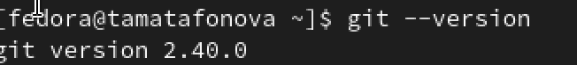
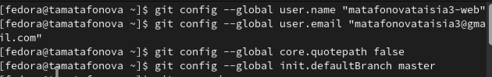
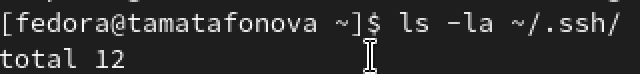
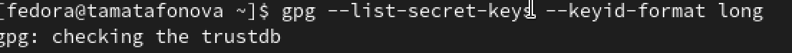
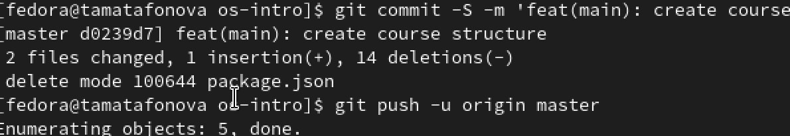

---
author:
  name: Матафонова Таисия Антоновна 
  degrees: DSc
  orcid: 0000-0002-0877-7063
  email: 1032253843@rudn.ru
  affiliation:
    - name: Российский университет дружбы народов
      country: Российская Федерация
      postal-code: 117198
      city: Москва
      address: ул. Миклухо-Маклая, д. 6
title: "Лабораторная работа №2"
subtitle: "Первоначальна настройка git"
license: "CC BY"
editor: 
  markdown: 
    wrap: 72
---

# Цель работы

Изучить идеологию и применение средств контроля версий.Освоить умения по
работе с git.

# Теоретическое введение

Системы контроля версий. Общие понятия

Системы контроля версий (Version Control System, VCS) применяются при
работе нескольких человек над одним проектом. Обычно основное дерево
проекта хранится в локальном или удалённом репозитории, к которому
настроен доступ для участников проекта. При внесении изменений в
содержание проекта система контроля версий позволяет их фиксировать,
совмещать изменения, произведённые разными участниками проекта,
производить откат к любой более ранней версии проекта, если это
требуется.

В классических системах контроля версий используется централизованная
модель, предполагающая наличие единого репозитория для хранения файлов.
Выполнение большинства функций по управлению версиями осуществляется
специальным сервером. Участник проекта (пользователь) перед началом
работы посредством определённых команд получает нужную ему версию
файлов. После внесения изменений, пользователь размещает новую версию в
хранилище. При этом предыдущие версии не удаляются из центрального
хранилища и к ним можно вернуться в любой момент. Сервер может сохранять
не полную версию изменённых файлов, а производить так называемую
дельта-компрессию — сохранять только изменения между последовательными
версиями, что позволяет уменьшить объём хранимых данных.

Системы контроля версий поддерживают возможность отслеживания и
разрешения конфликтов, которые могут возникнуть при работе нескольких
человек над одним файлом. Можно объединить (слить) изменения, сделанные
разными участниками (автоматически или вручную), вручную выбрать нужную
версию, отменить изменения вовсе или заблокировать файлы для изменения.
В зависимости от настроек блокировка не позволяет другим пользователям
получить рабочую копию или препятствует изменению рабочей копии файла
средствами файловой системы ОС, обеспечивая таким образом,
привилегированный доступ только одному пользователю, работающему с
файлом.

Системы контроля версий также могут обеспечивать дополнительные, более
гибкие функциональные возможности. Например, они могут поддерживать
работу с несколькими версиями одного файла, сохраняя общую историю
изменений до точки ветвления версий и собственные истории изменений
каждой ветви. Кроме того, обычно доступна информация о том, кто из
участников, когда и какие изменения вносил. Обычно такого рода
информация хранится в журнале изменений, доступ к которому можно
ограничить.

В отличие от классических, в распределённых системах контроля версий
центральный репозиторий не является обязательным.

Среди классических VCS наиболее известны CVS, Subversion, а среди
распределённых — Git, Bazaar, Mercurial. Принципы их работы схожи,
отличаются они в основном синтаксисом используемых в работе команд.

Примеры использования git

```         
Система контроля версий Git представляет собой набор программ командной строки. Доступ к ним можно получить из терминала посредством ввода команды git с различными опциями.
Благодаря тому, что Git является распределённой системой контроля версий, резервную копию локального хранилища можно сделать простым копированием или архивацией.
```

Основные команды git

```         
Перечислим наиболее часто используемые команды git.

Создание основного дерева репозитория:

git init

Получение обновлений (изменений) текущего дерева из центрального репозитория:

git pull

Отправка всех произведённых изменений локального дерева в центральный репозиторий:

git push

Просмотр списка изменённых файлов в текущей директории:

git status

Просмотр текущих изменений:

git diff

Сохранение текущих изменений:

    добавить все изменённые и/или созданные файлы и/или каталоги:

    git add .

    добавить конкретные изменённые и/или созданные файлы и/или каталоги:

    git add имена_файлов

    удалить файл и/или каталог из индекса репозитория (при этом файл и/или каталог остаётся в локальной директории):

    git rm имена_файлов

Сохранение добавленных изменений:

    сохранить все добавленные изменения и все изменённые файлы:

    git commit -am 'Описание коммита'

    сохранить добавленные изменения с внесением комментария через встроенный редактор:

    git commit

    создание новой ветки, базирующейся на текущей:

    git checkout -b имя_ветки

    переключение на некоторую ветку:

    git checkout имя_ветки

        (при переключении на ветку, которой ещё нет в локальном репозитории, она будет создана и связана с удалённой)

    отправка изменений конкретной ветки в центральный репозиторий:

    git push origin имя_ветки

    слияние ветки с текущим деревом:

    git merge --no-ff имя_ветки

Удаление ветки:

    удаление локальной уже слитой с основным деревом ветки:

    git branch -d имя_ветки

    принудительное удаление локальной ветки:

    git branch -D имя_ветки

    удаление ветки с центрального репозитория:

    git push origin :имя_ветки
```

Стандартные процедуры работы при наличии центрального репозитория

```         
Работа пользователя со своей веткой начинается с проверки и получения изменений из центрального репозитория (при этом в локальное дерево до начала этой процедуры не должно было вноситься изменений):

git checkout master
git pull
git checkout -b имя_ветки

Затем можно вносить изменения в локальном дереве и/или ветке.

После завершения внесения какого-то изменения в файлы и/или каталоги проекта необходимо разместить их в центральном репозитории. Для этого необходимо проверить, какие файлы изменились к текущему моменту:

git status

При необходимости удаляем лишние файлы, которые не хотим отправлять в центральный репозиторий.

Затем полезно просмотреть текст изменений на предмет соответствия правилам ведения чистых коммитов:

git diff

Если какие-либо файлы не должны попасть в коммит, то помечаем только те файлы, изменения которых нужно сохранить. Для этого используем команды добавления и/или удаления с нужными опциями:

git add …  
git rm …

Если нужно сохранить все изменения в текущем каталоге, то используем:

git add .

Затем сохраняем изменения, поясняя, что было сделано:
```

# Выполнение лабораторной работы

1.  Проверка установленной версии Git. В системе установлена версия
    2.40.0, что говорит о готовности Git к работе.

{#fig:001}

2.Установка утилиты GitHub CLI для удобной работы с репозиториями через
терминал. После установки проверяем версию

{#fig:002}

3.Настройка глобальных параметров Git: имя пользователя и email (должны
совпадать с данными на GitHub), отключение экранирования путей (для
корректного отображения кириллицы), установка имени начальной ветки по
умолчанию (master).

{#fig:003}

4.Просмотр содержимого каталога .ssh. Обнаружены существующие ключи
study-key и study-key.pub, что говорит о наличии ранее созданных
SSH-ключей.

{#fig:004}

5.Вывод содержимого публичного SSH-ключа для последующего добавления на
GitHub. Ключ типа ed25519.

{#fig:005}

6.Генерация GPG-ключа.

{#fig:006}

7.  Вывод списка секретных GPG-ключей с длинным форматом идентификатора.
    Виден созданный ключ с идентификатором 738498296EC1D817.

{#fig:007}

8.Настройка автоматической подписи всех коммитов с использованием
созданного GPG-ключа. Указывается программа GPG для подписи.Экспорт
публичного GPG-ключа в текстовом формате (ASCII) для последующего
добавления в настройки аккаунта GitHub.

{#fig:008}

9.Интерактивная авторизация в GitHub CLI.

{#fig:009}

10. Создание иерархии каталогов для хранения лабораторных работ по
    предмету "Операционные системы" в учебном году 2025-2026, cоздание
    публичного репозитория на GitHub на основе готового шаблона для
    студенческих работ. Клонирование созданного репозитория на локальную
    машину с рекурсивным получением всех подмодулей.

{#fig:010}

11.Переход в каталог репозитория. Удаление ненужного файла package.json,
создание файла COURSE с названием предмета, создание каталогов для
лабораторных работ и проектов. Добавление всех созданных и измененных
файлов в индекс Git для последующего коммита.Успешное создание
подписанного коммита.

{#fig:011}

12. Отправка созданного коммита в удаленный репозиторий на GitHub.
    Установлена связь между локальной веткой master и удаленной веткой
    origin/master.

{#fig:012}

\# Выводы

Выводы

В ходе выполнения лабораторной работы были получены и закреплены
практические навыки:

```         
Настройка Git: освоены базовые команды конфигурации, установка имени пользователя, email, параметров работы с переносами строк и именем ветки по умолчанию.

Работа с SSH-ключами: проверены существующие ключи, изучена структура каталога .ssh, получен публичный ключ для добавления на GitHub.

Создание GPG-ключа: освоен процесс генерации ключа для подписи коммитов с параметрами RSA 4096 бит, настройка срока действия, экспорт публичного ключа.

Настройка подписи коммитов: выполнена интеграция GPG с Git, настроена автоматическая подпись всех коммитов, исправлена ошибка с неправильным идентификатором ключа.

Работа с GitHub CLI: выполнена авторизация через браузер, настроен SSH-протокол для работы с репозиториями.

Создание и клонирование репозитория: на основе шаблона создан публичный репозиторий, выполнено его клонирование с подмодулями.

Подготовка структуры проекта: созданы необходимые каталоги для лабораторных работ, удалены лишние файлы.

Создание подписанного коммита: успешно создан коммит с GPG-подписью, подтверждена его верификация на GitHub (зеленая метка Verified).

Отправка изменений: выполнена синхронизация локального и удаленного репозиториев.
```

# Список литературы {.unnumbered}

1.ТУИС РУДН "Лабораторная работа №2"

# Ответы на контрольные вопросы

Вопрос 1: Для чего нужна система контроля версий Git?

Ответ: Git — это распределенная система контроля версий, которая
позволяет:

```         
Отслеживать историю изменений файлов

Работать над проектом нескольким разработчикам одновременно

Создавать отдельные ветки для разработки новых функций

Откатываться к предыдущим версиям при необходимости

Сливать изменения из разных веток

Хранить полную копию репозитория у каждого разработчика
```

Вопрос 2: Чем отличается SSH-аутентификация от HTTPS при работе с
GitHub?

Ответ:

```         
SSH: использует пару ключей (приватный/публичный) для аутентификации. Более безопасный метод, не требует ввода пароля при каждом обращении. Приватный ключ хранится на локальной машине, публичный — на GitHub.

HTTPS: требует ввода имени пользователя и пароля (или personal access token). Может быть заблокирован корпоративными файрволами, но работает через стандартные порты (443). Удобен, если нет доступа к SSH-порту.
```

Вопрос 3: Что такое GPG-ключ и зачем подписывать коммиты?

Ответ: GPG (GNU Privacy Guard) — это реализация стандарта OpenPGP для
шифрования и подписи данных. Подпись коммитов позволяет:

```         
Подтвердить авторство коммита (кто действительно сделал изменения)

Гарантировать, что содержимое коммита не было изменено после подписи

Получить на GitHub метку "Verified", что повышает доверие к репозиторию

Защитить от подделки коммитов (никто не может выдать себя за другого разработчика)
```

Вопрос 4: Какие основные команды Git были использованы в работе?

Ответ:

```         
git config — настройка параметров Git

git init — инициализация репозитория (не использовалась, т.к. клонировали)

git clone — клонирование удаленного репозитория

git add — добавление файлов в индекс

git commit — создание коммита (с флагом -S для подписи)

git push — отправка изменений на удаленный репозиторий

git status — просмотр состояния репозитория (использовалась неявно)

git log — просмотр истории коммитов (использовалась неявно)
```

Вопрос 5: Что такое файл .gitignore и для чего он нужен?

Ответ: .gitignore — это специальный файл, в котором перечисляются
шаблоны файлов и каталогов, которые Git должен игнорировать. Это полезно
для:

```         
Временных файлов, создаваемых редакторами (например, *.swp)

Скомпилированных объектных файлов (*.o, *.exe)

Файлов конфигурации с паролями

Папок с зависимостями (node_modules, vendor)

Системных файлов (.DS_Store, Thumbs.db)
```

Вопрос 6: Как проверить, что коммит подписан корректно?

Ответ:

```         
Локально: командой git log --show-signature -1 — будет показана информация о подписи и ее валидности.

На GitHub: в списке коммитов рядом с подписанным коммитом отображается зеленая метка "Verified". При клике на коммит можно увидеть детальную информацию о подписи.

В настройках GitHub можно включить "Vigilant mode", который будет помечать все неподписанные коммиты как "Unverified".
```

Вопрос 7: Какие проблемы возникли в процессе работы и как они были
решены? Проблем не было
