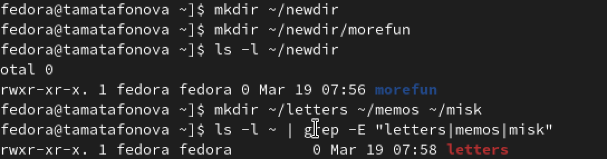
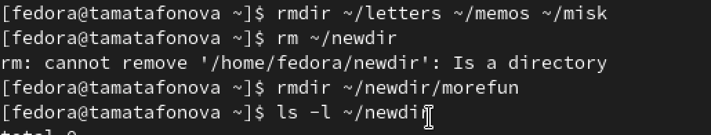

---
author:
  name: Матафонова Таисия Антоновна 
  degrees: DSc
  orcid: 0000-0002-0877-7063
  email: 1032253843@rudn.ru
  affiliation:
    - name: Российский университет дружбы народов
      country: Российская Федерация
      postal-code: 117198
      city: Москва
      address: ул. Миклухо-Маклая, д. 6
title: "Лабораторная работа №6"
subtitle: "Основы интерфейса взаимодействия пользователя с системой Unix на уровне командной строки"
license: "CC BY"
editor: 
  markdown: 
    wrap: 72
---

# Цель работы

Приобретение практических навыков взаимодействия пользователя с системой
по- средством командной строки.

# Теоретическое введение

В операционной системе типа Linux взаимодействие пользователя с системой
обычно осуществляется с помощью командной строки посредством построчного
ввода ко- манд. При этом обычно используется командные интерпретаторы
языка shell: /bin/sh; /bin/csh; /bin/ksh. Формат команды. Командой в
операционной системе называется записанный по специальным правилам текст
(возможно с аргументами), представляющий собой ука- зание на выполнение
какой-либо функций (или действий) в операционной системе. Обычно первым
словом идёт имя команды, остальной текст — аргументы или опции,
конкретизирующие действие. Общий формат команд можно представить
следующим образом: <имя_команды><разделитель><аргументы> Команда man.
Команда man используется для просмотра (оперативная помощь) в диа-
логовом режиме руководства (manual) по основным командам операционной
системы типа Linux. Формат команды: man <команда> Пример (вывод
информации о команде man): man man Для управления просмотром результата
выполнения команды man можно использовать следующие клавиши: – – –
ционной системы типа Linux. Замечание 1. Файловая система ОС типа Linux
— иерархическая система каталогов, подкаталогов и файлов, которые обычно
организованы и сгруппированы по функ- циональному признаку. Самый
верхний каталог в иерархии называется корневым и обозначается символом
/. Корневой каталог содержит системные файлы и другие каталоги. Формат
команды: Space — перемещение по документу на одну страницу вперёд; Enter
— перемещение по документу на одну строку вперёд; q — выход из режима
просмотра описания. Команда cd. Команда cd используется для перемещения
по файловой системе опера- cd \[путь_к\_каталогу\] Кулябов Д. С. и др.
Операционные системы 39 1 1 1 1 1 2 Для перехода в домашний каталог
пользователя следует использовать команду cd без параметров или cd \~.
Например, команда cd /afs/dk.sci.pfu.edu.ru/home позволяет перейти в
каталог /afs/dk.sci.pfu.edu.ru/home (если такой существует), а для того,
чтобы подняться выше на одну директорию, следует использовать: cd ..
Подробнее об опциях команды cd смотри в справке с помощью команды man:
man cd Команда pwd. Для определения абсолютного пути к текущему каталогу
используется команда pwd (print working directory). Пример (абсолютное
имя текущего каталога пользователя dharma): pwd результат: Сокращения
имён файлов. В работе с командами, в качестве аргументов которых
выступает путь к какому-либо каталогу или файлу, можно использовать
сокращённую запись пути. Символы сокращения приведены в табл. 4.1. 1 2 3
4 /afs/dk.sci.pfu.edu.ru/home/d/h/dharma Символы сокращения имён файлов
Символ \~ . .. Значение Домашний каталог Текущий каталог Родительский
каталог Таблица 4.1 Например, в команде cd для перемещения по файловой
системе сокращённую за- пись пути можно использовать следующим образом
(команды чередуются с выводом результата выполнения команды pwd): pwd
/afs/dk.sci.pfu.edu.ru/home/d/h/dharma

40 Лабораторная работа No 4. Основы интерфейса взаимодействия
пользователя с системой ... cd .. pwd /afs/dk.sci.pfu.edu.ru/home/d/h cd
../.. pwd /afs/dk.sci.pfu.edu.ru/home cd \~/work pwd
/afs/dk.sci.pfu.edu.ru/home/d/h/dharma/work 5 6 7 8 9 10 11 12 13 14 15
16 17 18 1 2 3 4 5 6 7 8 9 1 Команда ls используется для просмотра
содержимого каталога. Формат команды: ls \[-опции\] \[путь\] Пример:
Команда ls. cd cd .. pwd /afs/dk.sci.pfu.edu.ru/home/d/h ls dharma
Некоторые файлы в операционной системе скрыты от просмотра и обычно
исполь- зуются для настройки рабочей среды. Имена таких файлов
начинаются с точки. Для того, чтобы отобразить имена скрытых файлов,
необходимо использовать команду ls с опцией a: ls -a Можно также
получить информацию о типах файлов (каталог, исполняемый файл, ссылка),
для чего используется опция F. При использовании этой опции в поле имени
выводится символ, который определяет тип файла (см. табл. 4.2) Символ,
который определяет тип файла Символ Таблица 4.2 Тип файла Каталог /
Исполняемый файл \* Ссылка \@

Кулябов Д. С. и др. Операционные системы 41 1 2 1 2 1 1 2 3 4 5 6 7 8 9
10 11 12 13 14 15 16 17 18 Чтобы вывести на экран подробную информацию о
файлах и каталогах, необходимо использовать опцию l. При этом о каждом
файле и каталоге будет выведена следующая информация: – типфайла, –
праводоступа, – числоссылок, – владелец, – размер, –
датапоследнейревизии, – имяфайлаиликаталога. Пример: Результат: В этом
же каталоге команда ls -alF даст примерно следующий результат: cd / ls
bin boot dev etc home lib media mnt opt proc root sbin sys tmp usr var
drwxr-xr-x drwxr-xr-x drwxr-xr-x drwxr-xr-x drwxr-xr-x drwxr-xr-x
drwxr-xr-x lrwxrwxrwx drwxr-xr-x drwxr-xr-x drwxr-xr-x dr-xr-xr-x
drwxr-xr-x drwxr-xr-x drwxr-xr-x drwxrwxrwt drwxr-xr-x drwxr-xr-x 21
root root 21 root root 2 root root 2 root root 20 root root 170 root
root 6 root root 1 root root 8 root root 5 root root 25 root root 163
root root 31 root root 2 root root 12 root root 12 root root 22 root
root 17 root root 4096 Jan. 17 09:00 ./ 4096 Jan. 17 09:00 ../ 4096 Jan.
18 15:57 bin/ 4096 Apr. 14 2008 boot/ 14120 Feb. 17 10:48 dev/ 12288
Feb. 17 09:19 etc/ 4096 Aug. 5 2009 home/ 5 Jan. 12 22:01 lib -\> lib64/
4096 Jan. 30 21:41 media/ 4096 Jan. 17 2010 mnt/ 4096 Jan. 16 09:55 opt/
0 Feb. 17 13:17 proc/ 4096 Feb. 15 23:57 root/ 12288 Jan. 18 15:57 sbin/
0 Feb. 17 13:17 sys/ 500 Feb. 17 16:35 tmp/ 4096 Jan. 18 09:26 usr/ 4096
Jan. 14 17:38 var/ Команда mkdir используется для создания каталогов.
Формат команды: Команда mkdir. mkdir имя_каталога1 \[имя_каталога2...\]
Пример создания каталога в текущем каталоге:

1 2 3 4 5 6 7 8 9 10 11 12 13 14 15 1 2 1 2 1 1 1 Замечание2.
Длятогочтобысоздатькаталогвопределённомместефайловойсистемы, должны быть
правильно установлены права доступа. Можно создать также подкаталог в
существующем подкаталоге: При задании нескольких аргументов создаётся
несколько каталогов: Можно использовать группировку: mkdir
parentdir/{dir1,dir2,dir3} Если же требуется создать подкаталог в
каталоге, отличном от текущего, то путь к нему требуется указать в явном
виде: mkdir ../dir1/dir2 или mkdir \~/dir1/dir2 Интересны следующие
опции: --mode (или -m) — установка атрибутов доступа; --parents (или -p)
— создание каталога вместе с родительскими по отношению к нему
каталогами. Атрибуты задаются в численной или символьной нотации: 42
Лабораторная работа No 4. Основы интерфейса взаимодействия пользователя
с системой ... cd pwd /afs/dk.sci.pfu.edu.ru/home/d/h/dharma ls Desktop
public tmp GNUstep public_html work mkdir abc ls abc GNUstep public_html
work Desktop public tmp mkdir parentdir mkdir parentdir/dir cd parentdir
mkdir dir1 dir2 dir3 1 mkdir --mode=777 dir

1 1 Кулябов Д. С. и др. Операционные системы 43 или mkdir -m a+rwx dir
Опция --parents (краткая форма -p) позволяет создавать иерархическую
цепочку подкаталогов, создавая все промежуточные каталоги: mkdir -p
\~/dir1/dir2/dir3 Команда rm. Команда rm используется для удаления
файлов и/или каталогов. Формат команды: rm \[-опции\] \[файл\] Если
требуется, чтобы выдавался запрос подтверждения на удаление файла, то
необхо- димо использовать опцию i. Чтобы удалить каталог, содержащий
файлы, нужно использовать опцию r. Без указания этой опции команда не
будет выполняться. Пример: cd mkdir abs rm abc rm: abc is a directory rm
-r abc 1 2 3 4 5 6 7 Если каталог пуст, то можно воспользоваться
командой rmdir. Если удаляемый каталог содержит файлы, то команда не
будет выполнена — нужно использовать rm - r имя_каталога. Команда
history. Для вывода на экран списка ранее выполненных команд исполь-
зуется команда history. Выводимые на экран команды в списке нумеруются.
К любой команде из выведенного на экран списка можно обратиться по её
номеру в списке, воспользовавшись конструкцией !<номер_команды>. Пример:
history 1 pwd 2 ls 3 ls -a 4 ls -l 5 cd / 6 history !5 cd / 1 2 3 4 5 6
7 8 9 10 Можно модифицировать команду из выведенного на экран списка при
помощи следу- ющей конструкции:

# Выполнение лабораторной работы

1.Проверяем текущий каталог, переходим в /tmp, снова проверяем и смотрим
содержимое.

{#fig:001}

2.Смотрим скрытые файлы (-а), подробную информацию (-l), все вместе
(-al) и типы файлов (-F).

{#fig:002}

3.Проверяем наличие каталога cron, возвращаемся в домашнй каталог и
смотрим владельцев каталога.

{#fig:003}

4.Создаем вложенные каталоги, проверяем. Создаем три папки одной
строкой, проверям через grep.

{#fig:004}

5.Удаляем три папки, пробуем удалить newdir, удаляем вложенную morefun,
проверяем что внутри newdir пусто.

{#fig:005}

6.Смотрим историю команд, модифицируем команду по номеру.

{#fig:006}

# Выводы

В ходе выполнения лабораторной работы освоены базовые команды для навигации, управления каталогами и работы с документацией. Полученные навыки позволяют эффективно взаимодействовать с системой через командную строку.

# Список литературы 

1.ТУИС РУДН "Лабораторная работа №6"

# Ответы на контрольные вопросы:

1. Командная строка — это интерфейс взаимодействия пользователя с операционной системой, в котором команды вводятся в виде текстовых строк.

2. Для определения абсолютного пути текущего каталога используется команда pwd. Пример: pwd выведет /home/fedora.

3. Для определения типа файлов и их имен используется команда ls с опцией F. Пример: ls -F покажет имена файлов с символами: / для каталогов, * для исполняемых файлов, @ для ссылок.

4. Для отображения скрытых файлов используется опция -a команды ls. Пример: ls -a покажет все файлы, включая те, чьи имена начинаются с точки.

5. Для удаления файла используется команда rm, для удаления пустого каталога — rmdir. Можно ли сделать одной командой: да, командой rm с опцией -r можно удалить каталог вместе с содержимым. Пример: rm файл.txt, rmdir пустой_каталог, rm -r каталог_с_файлами.

6. Для вывода списка последних выполненных команд используется команда history.

7. Для модифицированного выполнения команды из истории используется конструкция !номер:s/что_меняем/на_что_меняем. Пример: !118:s/-l/-a/ заменит в команде под номером 118 опцию -l на -a и выполнит её.

8. Пример запуска нескольких команд в одной строке: cd /tmp; ls -l (сначала перейти в /tmp, затем показать содержимое).

9. Экранирование — это способ использования специальных символов как обычных с помощью обратного слеша \. Пример: нужно создать файл с именем *? Можно так: touch \* — тогда создастся файл с именем *, а не будет воспринято как спецсимвол.

10. После выполнения команды ls с опцией l выводится подробная информация: тип файла, права доступа, количество ссылок, владелец, группа, размер, дата последнего изменения и имя файла.

11. Относительный путь — это путь относительно текущего каталога. Абсолютный путь начинается от корневого каталога /. Пример абсолютного пути: cd /home/fedora/Documents. Пример относительного пути: cd Documents (если текущий каталог /home/fedora).

12. Информацию о команде можно получить с помощью команды man. Пример: man ls покажет руководство по команде ls.

13. Для автоматического дополнения вводимых команд используется клавиша Tab.