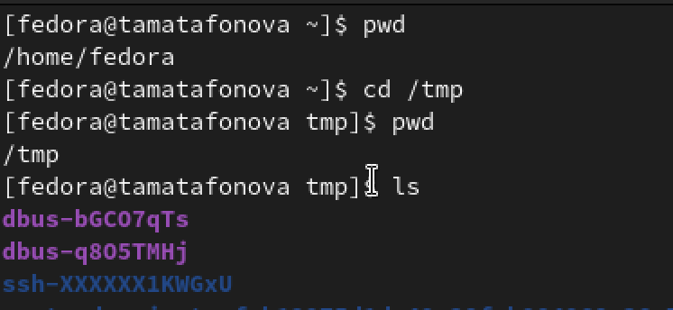
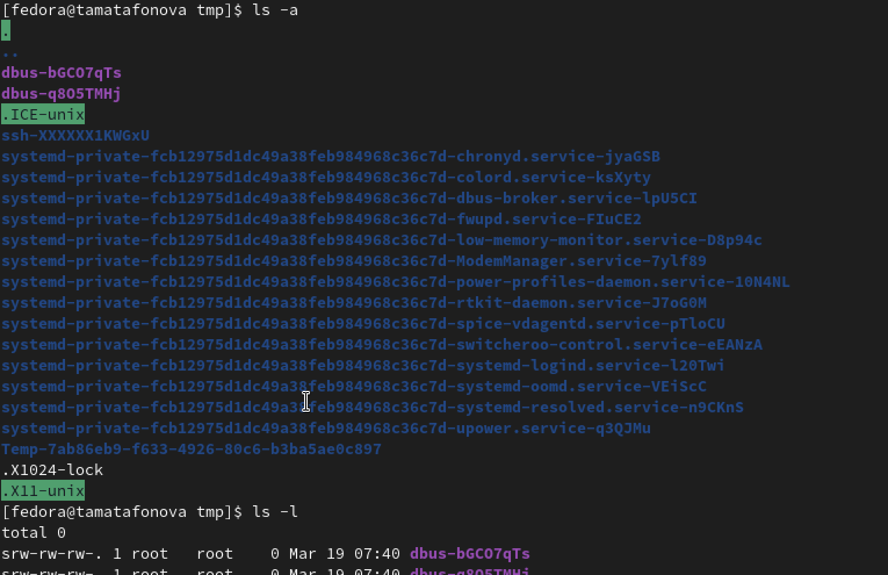
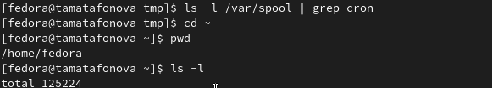
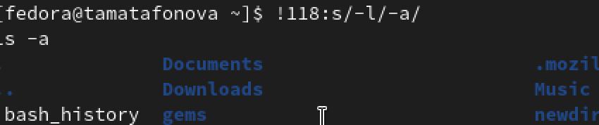

# Настройка рабочей среды

Автор: Матафонова Таисия Антоновнв Преподаватель: Кулябов Дмитрий Сергеевич профессор \* профессор кафедры теории вероятностей и кибербезопасности \* Российский университет дружбы народов им. П. Лумумбы \* [kulyabov-ds\@rudn.ru](mailto:kulyabov-ds@rudn.ru) \* <https://yamadharma.github.io/ru/>

**Информация о докладчике**

Студентка НБИбд-01-25

------------------------------------------------------------------------

# Цель работы

Приобретение практических навыков взаимодействия пользователя с системой по- средством командной строки.

------------------------------------------------------------------------

# Выполнение лабораторной работы

1.Проверяем текущий каталог, переходим в /tmp, снова проверяем и смотрим содержимое.

{#fig:001}

------------------------------------------------------------------------

2.Смотрим скрытые файлы (-а), подробную информацию (-l), все вместе (-al) и типы файлов (-F).

{#fig:002}

------------------------------------------------------------------------

3.Проверяем наличие каталога cron, возвращаемся в домашнй каталог и смотрим владельцев каталога.

{#fig:003}

------------------------------------------------------------------------

4.Создаем вложенные каталоги, проверяем. Создаем три папки одной строкой, проверям через grep.

{#fig:004}

------------------------------------------------------------------------

5.Удаляем три папки, пробуем удалить newdir, удаляем вложенную morefun, проверяем что внутри newdir пусто.

{#fig:005}

------------------------------------------------------------------------

6.Смотрим историю команд, модифицируем команду по номеру.

{#fig:006}

------------------------------------------------------------------------

# Выводы

В ходе выполнения лабораторной работы освоены базовые команды для навигации, управления каталогами и работы с документацией. Полученные навыки позволяют эффективно взаимодействовать с системой через командную строку.

------------------------------------------------------------------------

# Ответы на контрольные вопросы

1.  Командная строка — это интерфейс взаимодействия пользователя с операционной системой, в котором команды вводятся в виде текстовых строк.

2.  Для определения абсолютного пути текущего каталога используется команда pwd. Пример: pwd выведет /home/fedora.

3.  Для определения типа файлов и их имен используется команда ls с опцией F. Пример: ls -F покажет имена файлов с символами: / для каталогов, \* для исполняемых файлов, \@ для ссылок.

4.  Для отображения скрытых файлов используется опция -a команды ls. Пример: ls -a покажет все файлы, включая те, чьи имена начинаются с точки.

5.  Для удаления файла используется команда rm, для удаления пустого каталога — rmdir. Можно ли сделать одной командой: да, командой rm с опцией -r можно удалить каталог вместе с содержимым. Пример: rm файл.txt, rmdir пустой_каталог, rm -r каталог_с\_файлами.

6.  Для вывода списка последних выполненных команд используется команда history.

7.  Для модифицированного выполнения команды из истории используется конструкция !номер:s/что_меняем/на_что_меняем. Пример: !118:s/-l/-a/ заменит в команде под номером 118 опцию -l на -a и выполнит её.

8.  Пример запуска нескольких команд в одной строке: cd /tmp; ls -l (сначала перейти в /tmp, затем показать содержимое).

9.  Экранирование — это способ использования специальных символов как обычных с помощью обратного слеша . Пример: нужно создать файл с именем *? Можно так: touch \* — тогда создастся файл с именем* , а не будет воспринято как спецсимвол.

10. После выполнения команды ls с опцией l выводится подробная информация: тип файла, права доступа, количество ссылок, владелец, группа, размер, дата последнего изменения и имя файла.

11. Относительный путь — это путь относительно текущего каталога. Абсолютный путь начинается от корневого каталога /. Пример абсолютного пути: cd /home/fedora/Documents. Пример относительного пути: cd Documents (если текущий каталог /home/fedora).

12. Информацию о команде можно получить с помощью команды man. Пример: man ls покажет руководство по команде ls.

13. Для автоматического дополнения вводимых команд используется клавиша Tab.

------------------------------------------------------------------------

# Список литературы

ТУИС. Архитектура компьютеров и операционные системы. Раздел "Операционные системы". Лабораторная работа №6.

<https://esystem.rudn.ru/mod/page/view.php?id=1358330>
