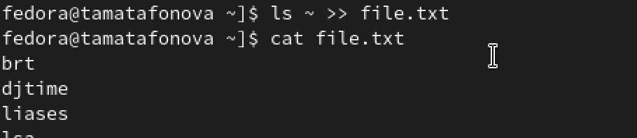
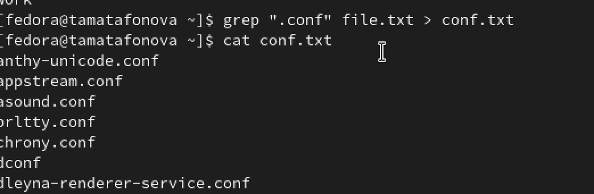
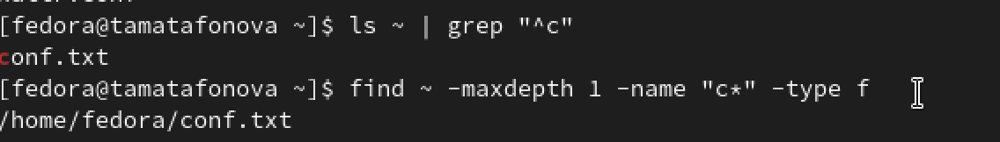
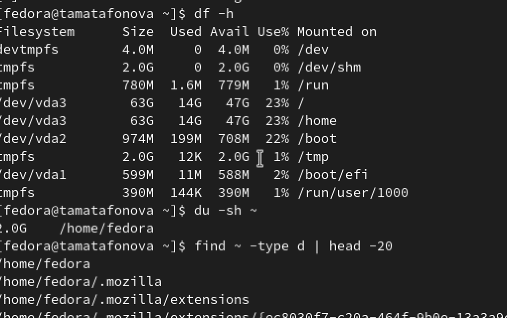

---
author:
  name: Матафонова Таисия Антоновна 
  degrees: DSc
  orcid: 0000-0002-0877-7063
  email: 1032253843@rudn.ru
  affiliation:
    - name: Российский университет дружбы народов
      country: Российская Федерация
      postal-code: 117198
      city: Москва
      address: ул. Миклухо-Маклая, д. 6
title: "Лабораторная работа №8"
subtitle: "Поиск файлов. Перенаправление ввода-вывода. Просмотр запущенных процессов"
license: "CC BY"
editor: 
  markdown: 
    wrap: 72
---

# Цель работы

Ознакомление с инструментами поиска файлов и фильтрации текстовых
данных. Приобретение практических навыков по управлению процессами и
заданиями, проверке использования диска и обслуживанию файловых систем.

# Теоретическое введение

6.2.1. Перенаправление ввода-вывода В системе по умолчанию открыто три
специальных потока: – stdin — стандартный поток ввода (по умолчанию:
клавиатура), файловый дескриптор 0; – stdout — стандартный поток вывода
(по умолчанию: консоль), файловый дескриптор 1; – stderr — стандартный
поток вывод сообщений об ошибках (по умолчанию: консоль), файловый
дескриптор 2. Большинство используемых в консоли команд и программ
записывают результаты своей работы в стандартный поток вывода stdout.
Например, команда ls выводит в стан- дартный поток вывода (консоль)
список файлов в текущей директории. Потоки вывода и ввода можно
перенаправлять на другие файлы или устройства. Проще всего это делается
с помощью символов \>, \>\>, \<, \<\<. Рассмотрим пример. 55

Перенаправление stdout (вывода) в файл.

Если файл отсутствовал, то он создаётся,

иначе -- перезаписывается.

Создаёт файл, содержащий список дерева каталогов.

ls -lR \> dir-tree.list 1\>filename \# Перенаправление вывода (stdout) в
файл "filename". 1\>\>filename \# Перенаправление вывода (stdout) в файл
"filename", \# файл открывается в режиме добавления. 2\>filename \#
Перенаправление stderr в файл "filename". 2\>\>filename \#
Перенаправление stderr в файл "filename", \# файл открывается в режиме
добавления. &\>filename \# Перенаправление stdout и stderr в файл
"filename". 1 2 3 4 5 6 7 8 9 10 11 12 13 14 15 16 17 18 19 56
Лабораторная работа No 6. Поиск файлов. Перенаправление ввода-вывода.
Просмотр ... 1 2 1 6.2.2. Конвейер Конвейер (pipe) служит для
объединения простых команд или утилит в цепочки, в ко- торых результат
работы предыдущей команды передаётся последующей. Синтаксис следующий:
Конвейеры можно группировать в цепочки и выводить с помощью
перенаправления в файл, например: ls -la \|sort \> sortilg_list вывод
команды ls -la передаётся команде сортировки sort\\verb, которая пишет
ре- зультат в файл sorting_list\\verb. Чаще всего скрипты на Bash
используются в качестве автоматизации каких-то рутин- ных операций в
консоли, отсюда иногда возникает необходимость в обработке stdout одной
команды и передача на stdin другой команде, при этом результат
выполнения команды должен обработан. 6.2.3. Поиск файла Команда find
используется для поиска и отображения на экран имён файлов, соответ-
ствующих заданной строке символов. Формат команды: find путь \[-опции\]
Путь определяет каталог, начиная с которого по всем подкаталогам будет
вестись поиск. Примеры: 1.
Вывестинаэкранименафайловизвашегодомашнегокаталогаиегоподкаталогов,
начинающихся на f: команда 1 \| команда 2 \# означает, что вывод команды
1 передастся на ввод команде 2 1 1 1 1 2. find \~ -name "f*" -print
Здесь \~ — обозначение вашего домашнего каталога, -name — после этой
опции указы- вается имя файла, который нужно найти, "f*" — строка
символов, определяющая имя файла, -print — опция, задающая вывод
результатов поиска на экран.
Вывестинаэкранименафайловвкаталоге/etc,начинающихсяссимволаp: find /etc
-name "p*" -print 3.
НайтивВашемдомашнемкаталогефайлы,именакоторыхзаканчиваютсясимволом \~ и
удалить их: find \~ -name "*\~" -exec rm "{}" ; Здесь опция -exec rm
"{}" ; задаёт применение команды rm ко всем файлам, име- на которых
соответствуют указанной после опции -name строке символов. Для просмотра
опций команды find воспользуйтесь командой man.

1 Кулябов Д. С. и др. Операционные системы 57 6.2.4. Фильтрация текста
Найти в текстовом файле указанную строку символов позволяет команда
grep. Формат команды: grep строка имя_файла Кроме того, команда grep
способна обрабатывать стандартный вывод других команд (любой текст). Для
этого следует использовать конвейер, связав вывод команды с вводом grep.
Примеры: 1.
Показатьстрокивовсехфайлахввашемдомашнемкаталогесименами,начинающи- мися
на f, в которых есть слово begin: grep begin f\* 2.
Найтивтекущемкаталогевсефайлы,содержащихвимени«лаб»: ls -l \| grep лаб
6.2.5. Проверка использования диска Команда df показывает размер каждого
смонтированного раздела диска. Формат команды: df \[-опции\]
\[файловая_система\] Пример: df -vi Команда du показывает число
килобайт, используемое каждым файлом или каталогом. Формат команды: du
\[-опции\] \[имя_файла...\] Пример. du -a \~/ На afs можно посмотреть
использованное пространство командой fs quota 1 1 1 1 1 1 1

58 Лабораторная работа No 6. Поиск файлов. Перенаправление ввода-вывода.
Просмотр ...

1 1 6.2.6. Управление задачами Любую выполняющуюся в консоли команду или
внешнюю программу можно запустить в фоновом режиме. Для этого следует в
конце имени команды указать знак амперсанда &. Например: gedit & Будет
запущен текстовой редактор gedit в фоновом режиме. Консоль при этом не
будет заблокирована. Запущенные фоном программы называются задачами
(jobs). Ими можно управлять с помощью команды jobs, которая выводит
список запущенных в данный момент задач. Для завершения задачи
необходимо выполнить команду kill %номер задачи 6.2.7. Управление
процессами Любой команде, выполняемой в системе, присваивается
идентификатор процесса (process ID). Получить информацию о процессе и
управлять им, пользуясь идентифи- катором процесса, можно из любого окна
командного интерпретатора. 6.2.8. Получение информации о процессах
Команда ps используется для получения информации о процессах. Формат
команды: ps \[-опции\] Для получения информации о процессах, управляемых
вами и запущенных (работаю- щих или остановленных) на вашем терминале,
используйте опцию aux. Пример: ps aux Для запуска команды в фоновом
режиме необходимо в конце командной строки ука- зать знак & (амперсанд).
Пример работы, требующей много машинного времени для выполнения, и
которую целесообразно запустить в фоновом режиме: find /var/log -name
"\*.log" -print \> l.log &

# Выполнение лабораторной работы

1.Создаю файл file.txt с содержимым каталогов /etc и домашнего

{#fig:001}

2.Фильтрую строки с .conf и сохраняю в conf.txt

{#fig:002}

3.Ищу файлы в домашнем каталоге, начинающиеся на c

{#fig:003}

4.Смотрю постранично файлы /etc на букву h

{#fig:004}

5.Запускаю фоновый поиск файлов log\* и проверяю задачи

{#fig:005}

6.Удаляю logfile, запускаю gedit в фоне и нахожу его PID

{#fig:006}

7.Завершаю процесс gedit по PID и проверяю

{#fig:007}

8.Проверяю дисковое пространство и ищу директории

{#fig:008}

#Контрольные вопросы

```         
В операционной системе существует три стандартных потока ввода-вывода: stdin (стандартный поток ввода, файловый дескриптор 0) — по умолчанию данные поступают с клавиатуры; stdout (стандартный поток вывода, файловый дескриптор 1) — по умолчанию выводит данные на экран (консоль); stderr (стандартный поток вывода ошибок, файловый дескриптор 2) — по умолчанию также выводит сообщения об ошибках на экран.

Операция «>» используется для перенаправления стандартного вывода в файл, при этом если файл уже существует, он будет перезаписан (старое содержимое удаляется). Операция «>>» также перенаправляет вывод в файл, но в отличие от «>», она открывает файл в режиме добавления, то есть новая информация дописывается в конец файла без удаления предыдущего содержимого.

Конвейер (pipe) — это механизм в командной строке, обозначаемый символом «|», который служит для объединения нескольких команд в цепочку, где результат работы предыдущей команды передаётся на ввод следующей. Это позволяет обрабатывать данные последовательно без создания промежуточных файлов.

Процесс — это программа, которая находится в состоянии выполнения, включая в себя код программы, текущие значения регистров, счётчик команд, стек и другие ресурсы. Отличие процесса от программы заключается в том, что программа — это пассивный набор инструкций, хранящийся на диске, а процесс — это активный экземпляр программы во время её выполнения со своим адресным пространством и контекстом.

PID (Process IDentifier) — это уникальный числовой идентификатор, который присваивается каждому процессу в системе в момент его создания. GID (Group IDentifier) — это идентификатор группы процессов, который позволяет объединять несколько процессов в одну группу для удобного управления ими, например, для отправки сигналов всем процессам группы одновременно.

Задачи (jobs) — это процессы, запущенные в текущей сессии командного интерпретатора, которые могут выполняться в фоновом или приостановленном режиме. Управлять задачами позволяет команда jobs, которая выводит список всех задач текущей сессии. Для управления также используются команды fg (перевод задачи на передний план), bg (перевод в фоновый режим) и kill (завершение задачи).

Утилита top — это интерактивная программа для мониторинга процессов в реальном времени, которая отображает список активных процессов, загрузку процессора, использование оперативной памяти и другую системную информацию. Утилита htop является улучшенной версией top с более удобным цветным интерфейсом, возможностью прокрутки списка процессов, управления мышью и более удобной системой отправки сигналов процессам. Обе утилиты позволяют администратору отслеживать нагрузку на систему и при необходимости завершать зависшие процессы.

Команда find — это мощный инструмент для поиска файлов и директорий в файловой системе. Формат команды: find путь [-опции]. Основные возможности: поиск по имени (-name), типу файла (-type), размеру (-size), времени модификации, а также выполнение действий над найденными файлами (-exec). Примеры использования: «find ~ -name ".txt" -type f» — найти все текстовые файлы в домашнем каталоге; «find /etc -name ".conf" -exec ls -l {} ;» — найти все конфигурационные файлы и показать подробную информацию о них; «find ~ -type d -name "Downloads"» — найти директорию с именем Downloads.

Да, можно найти файл по его содержимому. Для этого используется команда grep с рекурсивным режимом поиска: «grep -r "искомый текст" ~/» выполнит поиск указанной строки во всех файлах домашнего каталога и его подкаталогах. Также можно использовать комбинацию find и grep: «find ~ -type f -exec grep -l "текст" {} ;» сначала найдёт все файлы, а затем выполнит поиск текста внутри них.

Чтобы определить объём свободного пространства на жёстком диске, используется команда df (disk free). С опцией -h (human-readable) вывод становится удобным для чтения: «df -h» покажет размер каждого смонтированного раздела, использованное и свободное пространство в мегабайтах или гигабайтах. Также можно указать конкретную файловую систему: «df -h /dev/vda3».

Объём домашнего каталога определяется командой du (disk usage) с опцией -s (summary) для суммарного вывода и -h для удобного формата: «du -sh ~». Эта команда рекурсивно подсчитывает размер всех файлов и подкаталогов в домашней папке и выводит итоговый размер. Также можно получить размер конкретных подкаталогов: «du -sh ~/Documents».

Чтобы удалить зависший процесс, необходимо сначала узнать его PID с помощью команд «ps aux | grep имя_процесса» или «pgrep имя_процесса», а затем использовать команду kill с соответствующим PID: «kill PID». Если процесс не завершается обычным сигналом, используется принудительное завершение с сигналом SIGKILL: «kill -9 PID». Также можно завершить задачу по её номеру в текущей сессии: «kill %номер_задачи».
```

# Выводы

В ходе выполнения лабораторной работы №6 я ознакомился с инструментами
поиска файлов и фильтрации текстовых данных в операционной системе
Linux. Я научился перенаправлять стандартные потоки ввода-вывода с
помощью символов \>, \>\> и 2\>, а также использовать конвейеры для
передачи данных между командами. Были освоены команды find для поиска
файлов по различным критериям и grep для фильтрации текстовых данных. Я
получил практические навыки управления процессами и задачами: запуск
программ в фоновом режиме с помощью символа &, просмотр списка задач
командой jobs, определение идентификатора процесса (PID) через ps aux \|
grep, а также завершение процессов командой kill. Кроме того, я научился
проверять использование дискового пространства с помощью команд df -h и
du -sh. Также я освоил поиск всех директорий в домашнем каталоге
командой find \~ -type d. Таким образом, все поставленные цели
лабораторной работы были достигнуты, и я приобрел практические навыки,
необходимые для эффективной работы в командной строке Linux.

# Список литературы

1.ТУИС РУДН "Лабораторная работа №8"
