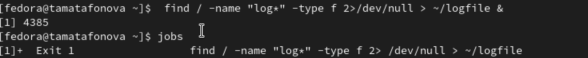

# Настройка рабочей среды

Автор: Матафонова Таисия Антоновнв Преподаватель: Кулябов Дмитрий
Сергеевич профессор \* профессор кафедры теории вероятностей и
кибербезопасности \* Российский университет дружбы народов им. П.
Лумумбы \* [kulyabov-ds\@rudn.ru](mailto:kulyabov-ds@rudn.ru) \*
<https://yamadharma.github.io/ru/>

**Информация о докладчике**

Студентка НБИбд-01-25

------------------------------------------------------------------------

# Цель работы

Ознакомление с инструментами поиска файлов и фильтрации текстовых
данных. Приобретение практических навыков по управлению процессами и
заданиями, проверке использования диска и обслуживанию файловых систем.

------------------------------------------------------------------------

# Выполнение лабораторной работы

1.Создаю файл file.txt с содержимым каталогов /etc и домашнего

{#fig:001}

---

2.Фильтрую строки с .conf и сохраняю в conf.txt

{#fig:002}

---

3.Ищу файлы в домашнем каталоге, начинающиеся на c

{#fig:003}

---

4.Смотрю постранично файлы /etc на букву h

{#fig:004}

---

5.Запускаю фоновый поиск файлов log\* и проверяю задачи

{#fig:005}

---

6.Удаляю logfile, запускаю gedit в фоне и нахожу его PID

{#fig:006}

---

7.Завершаю процесс gedit по PID и проверяю

{#fig:007}

---

8.Проверяю дисковое пространство и ищу директории

{#fig:008}
------------------------------------------------------------------------

# Список литературы

ТУИС. Архитектура компьютеров и операционные системы. Раздел
"Операционные системы". Лабораторная работа №8.

<https://esystem.rudn.ru/mod/page/view.php?id=1358330>
