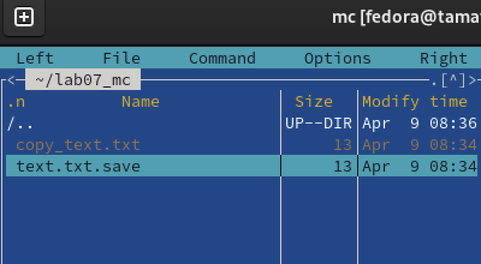

---
author:
  name: Матафонова Таисия Антоновна 
  degrees: DSc
  orcid: 0000-0002-0877-7063
  email: 1032253843@rudn.ru
  affiliation:
    - name: Российский университет дружбы народов
      country: Российская Федерация
      postal-code: 117198
      city: Москва
      address: ул. Миклухо-Маклая, д. 6
title: "Лабораторная работа №9"
subtitle: "Поиск файлов. Перенаправление ввода-вывода. Просмотр запущенных процессов"
license: "CC BY"
editor: 
  markdown: 
    wrap: 72
---

# Цель работы

Освоить основные возможности командной оболочки Midnight Commander,
получить навыки просмотра каталогов и файлов, выполнения операций
копирования, перемещения, редактирования и поиска файлов.

# Теоретическое введение

7.2.1. Общие сведения Командная оболочка — интерфейс взаимодействия
пользователя с операционной систе- мой и программным обеспечением
посредством команд. Midnight Commander (или mc) — псевдографическая
командная оболочка для UNIX/Linux систем. Для запуска mc необходимо в
командной строке набрать mc и нажать Enter . Рабочее пространство mc
имеет две панели, отображающие по умолчанию списки файлов двух каталогов
(рис. 7.1). Рис. 7.1. Внешний вид экрана при работе с Midnight Commander
Над панелями располагается меню, доступ к которому осуществляется с
помощью клавиши F9 . Под панелями внизу расположены управляющие экранные
кнопки, ассоци- ированные с функциональными клавишами F1 – F10 (табл.
7.1). Над ними располагается командная строка, предназначенная для ввода
команд.

Кулябов Д. С. и др. Операционные системы 61 Таблица 7.1 Функциональные
клавиши mc F1 Вызов контекстно-зависимой подсказки F2 Вызов
пользовательского меню с возможностью создания и/или допол- нения
дополнительных функций F3 Просмотр содержимого файла, на который
указывает подсветка в ак- тивной панели (без возможности редактирования)
F4 Вызов встроенного в mc редактора для изменения содержания файла, на
который указывает подсветка в активной панели F5 Копирование одного или
нескольких файлов, отмеченных в первой (активной) панели, в каталог,
отображаемый на второй панели F6 Перенос одного или нескольких файлов,
отмеченных в первой (актив- ной) панели, в каталог, отображаемый на
второй панели F7 Создание подкаталога в каталоге, отображаемом в
активной панели F8 Удаление одного или нескольких файлов (каталогов),
отмеченных в пер- вой (активной) панели файлов F9 Вызов меню mc F10
Выход из mc 7.2.2. Режимы отображения панелей и управление ими Панель в
mc отображает список файлов текущего каталога. Абсолютный путь к этому
каталогу отображается в заголовке панели. У активной панели заголовок и
одна из её строк подсвечиваются. Управление панелями осуществляется с
помощью определённых комбинаций клавиш или пунктов меню mc.
Панелиможнопоменятьместами.Дляэтогоииспользуетсякомбинацияклавиш Ctrl-u
или команда меню mc Переставить панели . Также можно временно убрать
отображение панелей (отключить их) с помощью комбинации клавиш Ctrl-o
или команды меню mc Отключить панели . Это может быть полезно, например,
если необходимо увидеть вывод какой-то информации на экран после
выполнения какой-либо команды shell. С помощью последовательного
применения комбинации клавиш Ctrl-x d есть возможность сравнения
каталогов, отображённых на двух панелях. Панели могут допол- нительно
быть переведены в один из двух режимов: Информация или Дерево . В режиме
Информация
(рис.7.2)напанельвыводятсясведенияофайлеитекущейфайловойсистеме,
расположенных на активной панели. В режиме Дерево (рис. 7.3) на одной из
панелей выводится структура дерева каталогов.
Управлятьрежимамиотображенияпанелейможночерезпунктыменюmc Праваяпанель и
Леваяпанель (рис.7.4). 7.2.3. Меню панелей Перейти в строку меню панелей
mc можно с помощью функциональной клавиши F9 . В строке меню имеются
пять меню: Левая панель , Файл , Настройки и Правая панель . Команда ,

62 Лабораторная работа No 7. Командная оболочка Midnight Commander Рис.
7.2. Режим Информация Рис. 7.3. Режим отображения дерева каталогов
Подпунктменю Быстрыйпросмотр
позволяетвыполнитьбыстрыйпросмотрсодержимого панели.

Кулябов Д. С. и др. Операционные системы 63 Рис. 7.4. Меню Левая Панель
Подпункт меню Информация позволяет посмотреть информацию о файле или
каталоге (рис. 7.5). Рис. 7.5. Панель Информация В меню каждой (левой
или правой) панели можно выбрать Формат списка : –
стандартный—выводитсписокфайловикаталоговсуказаниемразмераивремени
правки; –
ускоренный—позволяетзадатьчислостолбцов,накоторыеразбиваетсяпанельпри
выводе списка имён файлов или каталогов без дополнительной информации; –
расширенный—помимоназванияфайлаиликаталогавыводитсведенияоправах
доступа, владельце, группе, размере, времени правки;

64 Лабораторная работа No 7. Командная оболочка Midnight Commander –
определённыйпользователем—позволяетвывеститесведенияофайлеиликаталоге,
которые задаст сам пользователь. Подпункт меню Порядок сортировки
позволяет задать критерии сортировки при выводе списка файлов и
каталогов: без сортировки, по имени, расширенный, время правки, время
доступа, время изменения атрибута, размер, узел. 7.2.3.1. Меню Файл В
меню Файл содержит перечень команд, которые могут быть применены к
одному или нескольким файлам или каталогам (рис. 7.6). Рис. 7.6. Меню
Файл Команды меню Файл : – Просмотр ( F3 ) — позволяет посмотреть
содержимое текущего (или выделенного) файла без возможности
редактирования. – Просмотр вывода команды ( М + ! ) — функция запроса
команды с параметрами (аргумент к текущему выбранному файлу). – Правка (
F4 ) — открывает текущий (или выделенный) файл для его редактирования. –
Копирование ( F5 ) — осуществляет копирование одного или нескольких
файлов или каталогов в указанное пользователем во всплывающем окне
место. – Права доступа ( Ctrl-x c ) — позволяет указать (изменить) права
доступа к одному или нескольким файлам или каталогам (рис. 7.7).

Кулябов Д. С. и др. Операционные системы 65 Рис. 7.7. Права доступа на
файлы и каталоги – Жёсткая ссылка ( Ctrl-x l ) — позволяет создать
жёсткую ссылку к текущему (или выделенному) файлу1. – Символическая
ссылка ( Ctrl-x s ) — позволяет создать символическую ссылку к теку-
щему (или выделенному) файлу2. – Владелец/группа ( Ctrl-x o ) —
позволяет задать (изменить) владельца и имя группы для одного или
нескольких файлов или каталогов. –
Права(расширенные)—позволяетизменитьправадоступаивладениядляодного или
нескольких файлов или каталогов. – Переименование ( F6 ) — позволяет
переименовать (или переместить) один или несколько файлов или каталогов.
– Создание каталога ( F7 ) — позволяет создать каталог. – Удалить ( F8 )
— позволяет удалить один или несколько файлов или каталогов. –
Выход(F10)—завершаетработуmc. 7.2.3.2. Меню Команда В меню Команда
содержатся более общие команды для работы с mc (рис. 7.8). Команды меню
Команда : – Деревокаталогов—отображаетструктурукаталоговсистемы. –
Поискфайла—выполняетпоискфайловпозаданнымпараметрам. 1 Жёсткая ссылка
проявляется как реальный файл. После её создания невозможно определить,
где сам файл, а где ссылка на него. Если удалить один из этих файлов, то
другой останется целым. 2 Символическая ссылка — ссылка (указатель) на
имя файла-оригинала.

66 Лабораторная работа No 7. Командная оболочка Midnight Commander Рис.
7.8. Меню Команда – Переставитьпанели—меняетместамилевуюиправуюпанели. –
Сравнить каталоги ( Ctrl-x d ) — сравнивает содержимое двух каталогов. –
Размерыкаталогов—отображаетразмеривремяизменениякаталога(поумолчанию в
mc размер каталога корректно не отображается). –
Историякоманднойстроки—выводитнаэкрансписокранеевыполненныхвоболочке
команд. –
Каталогибыстрогодоступа(Ctrl-)—првызовевыполняетсябыстраясменатекущего
каталога на один из заданного списка. –
Восстановлениефайлов—позволяетвосстановитьфайлынафайловыхсистемахext2 и
ext3. –
Редактироватьфайлрасширений—позволяетзадатьспомощьюопределённогосин-
таксиса действия при запуске файлов с определённым расширением
(например, какое программного обеспечение запускать для открытия или
редактирования файлов с рас- ширением doc или docx). –
Редактироватьфайлменю—позволяетотредактироватьконтекстноеменюпользова-
теля, вызываемое по клавише F2 . –
Редактироватьфайлрасцветкиимён—позволяетподобратьоптимальнуюдляполь-
зователя расцветку имён файлов в зависимости от их типа. 7.2.3.3. Меню
Настройки Меню Настройки содержит ряд дополнительных опций по внешнему
виду и функцио- нальности mc (рис. 7.9). Меню Настройки содержит: –
Конфигурация—позволяетскорректироватьнастройкиработыспанелями.

Кулябов Д. С. и др. Операционные системы 67 Рис. 7.9. Меню Настройки –
ВнешнийвидиНастройкипанелей—определяетэлементы(строкаменю,команд- ная
строка, подсказки и прочее), отображаемые при вызове mc, а также
геометрию расположения панелей и цветовыделение. –
Битысимволов—задаётформатобработкиинформациилокальнымтерминалом. –
Подтверждение—позволяетустановитьилиубратьвыводокнасзапросомподтвер-
ждения действий при операциях удаления и перезаписи файлов, а также при
выходе из программы. – Распознание клавиш — диалоговое окно используется
для тестирования функцио- нальных клавиш, клавиш управления курсором и
прочее. – Виртуальные ФС –– настройки виртуальной файловой системы:
тайм-аут, пароль и прочее. 7.2.4. Редактор mc
Встроенныйвmcредакторвызываетсяспомощьюфункциональнойклавиши F4 .Внём
удобно использовать различные комбинации клавиш при редактировании
содержимого (как правило текстового) файла (табл. 7.2).

# Выполнение лабораторной работы

1.На скриншоте видно, что я запустила Midnight Commander командой `mc` в
терминале Fedora. Открылось стандартное рабочее пространство с двумя
панелями, на которых отображаются списки файлов и каталогов домашней
директории. В верхней части расположено меню (Left, File, Command,
Options, Right), внизу — функциональные клавиши F1–F10.

{#fig:001}

2.Я переключила одну из панелей в режим **«Информация»** через меню Left
Panel → Info. На панели отобразились подробные сведения о файле или
каталоге, на который указывает курсор: права доступа, владелец, размер,
даты изменения и доступа, информация о файловой системе и свободном
месте на диске

{#fig:002}

3.Я выделила файл `text.txt.save` в активной панели и нажала **F3** (или
выбрала File → View). Открылся встроенный просмотрщик, в котором
отобразилось содержимое файла — слово «Presentation». Просмотр
осуществляется без возможности редактирования, что соответствует
описанию работы клавиши F3.

{#fig:003}

4.Я открыла файл `text.txt.save` на редактирование с помощью **F4**
(File → Edit). В нижней части экрана отображается информация о положении
курсора (строка 1, колонка 1) и размере файла (26 байт). В данном случае
я находилась в процессе редактирования — видна строка «presentation
presentation.», которую я, вероятно, дописывала или изменяла.

{#fig:004}

5.Я перешла в созданный каталог `~/lab07_mc`. На левой панели вижу файлы
`copy_text.txt` и `text.txt.save`. Скорее всего, я скопировала один из
файлов с помощью **F5**, указав целевой каталог на второй панели.
Операция прошла успешно — файл `copy_text.txt` появился в каталоге.

{#fig:005}

6.Я выполнила поиск файлов через меню **Command → Find File**. В окне
поиска указала критерии (вероятно, расширение `.txt`) и получила
результат: найден файл `copy_text.txt` в каталоге
`/home/fedora/lab07_mc`. Это подтверждает, что функция поиска в mc
работает корректно.

{#fig:006}

#Контрольные вопросы 1. **Режимы mc:** стандартный (две панели со
списком файлов), режим «Информация» (сведения о файле/ФС), режим
«Дерево» (структура каталогов), быстрый просмотр.

2.  **Операции с файлами:** копирование (F5), перемещение (F6), удаление
    (F8), создание каталога (F7), просмотр (F3), редактирование (F4),
    изменение прав доступа.

3.  **Меню панели (Left/Right Panel):** Info, Tree, Quick View, Format
    list (стандартный, ускоренный, расширенный, пользовательский),
    Sorting order.

4.  **Меню File:** просмотр (F3), правка (F4), копирование (F5),
    перемещение (F6), удаление (F8), создание каталога (F7), права
    доступа, ссылки, владелец/группа.

5.  **Меню Command:** дерево каталогов, поиск файла, переставить панели,
    сравнить каталоги, история команд, каталоги быстрого доступа.

6.  **Меню Options (Настройки):** конфигурация, внешний вид,
    подтверждения, виртуальные ФС и др.

7.  **Встроенные команды mc:** F1–F10 (справка, меню, просмотр, правка,
    копирование, перемещение, создание каталога, удаление, меню
    настроек, выход).

8.  **Команды редактора mc:** Ctrl+Y (удалить строку), Ctrl+U (отмена),
    Ins (вставка/замена), F7 (поиск), F4 (замена), F5 (копировать), F6
    (переместить), F8 (удалить), F2 (сохранить).

9.  **Средства создания меню пользователя:** редактирование файла меню
    (Command → Edit menu file), создание контекстного меню по F2.

10. **Средства действий над текущим файлом:** редактирование файла
    расширений (Command → Edit extension file) для задания действий при
    запуске файлов с определёнными расширениями.

# Выводы

В ходе выполнения лабораторной работы я:

1.  Запустила Midnight Commander и изучила его интерфейс — две панели,
    меню, функциональные клавиши.
2.  Освоила режимы отображения панелей **«Информация»** и **«Дерево»**.
3.  Выполнила просмотр содержимого текстового файла с помощью F3.
4.  Отредактировала файл во встроенном редакторе (F4).
5.  Скопировала файл с помощью F5.
6.  Нашла файл по заданным условиям через Command → Find File.

Таким образом, цель работы достигнута: основные возможности Midnight
Commander освоены, навыки практической работы с файлами и каталогами
приобретены.

# Список литературы

1.ТУИС РУДН "Лабораторная работа №9"
