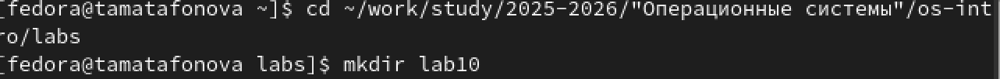

# Настройка рабочей среды

Автор: Матафонова Таисия Антоновнв Преподаватель: Кулябов Дмитрий
Сергеевич профессор \* профессор кафедры теории вероятностей и
кибербезопасности \* Российский университет дружбы народов им. П.
Лумумбы \* [kulyabov-ds\@rudn.ru](mailto:kulyabov-ds@rudn.ru) \*
<https://yamadharma.github.io/ru/>

**Информация о докладчике**

Студентка НБИбд-01-25

------------------------------------------------------------------------

# Цель работы

Познакомиться с операционной системой Linux. Получить практические
навыки рабо- ты с редактором vi, установленным по умолчанию практически
во всех дистрибутивах.

------------------------------------------------------------------------

# Выполнение лабораторной работы

1.Создала каталог lab10 и перешла в него

{#fig:001}

------------------------------------------------------------------------

2.Открыла редактор vi и создала файл hello.sh, ввела в него текст
программы

{#fig:002}

------------------------------------------------------------------------

3.Выполнила замену HELL на HELLO и удаление LOCAL с заменой на local

{#fig:003}

------------------------------------------------------------------------

4.Добавила новую строку echo \$HELLO в конец файла, затем удалила её и
вернула обратно командой u

{#fig:004}

------------------------------------------------------------------------

5.Просмотрела содержимое готового файла командой cat hello.sh

{#fig:005}

------------------------------------------------------------------------

#Контрольные вопросы

------------------------------------------------------------------------

Вопрос 1. Дайте краткую характеристику режимам работы редактора vi.

Редактор vi имеет три режима работы. Командный режим предназначен для
ввода команд редактирования и навигации по редактируемому файлу. Режим
вставки предназначен для ввода содержания редактируемого файла. Режим
последней строки (или командной строки) используется для записи
изменений в файл и выхода из редактора.

------------------------------------------------------------------------

Вопрос 2. Как выйти из редактора, не сохраняя произведённые изменения?

Чтобы выйти из редактора без сохранения изменений, необходимо находясь в
командном режиме нажать клавишу Esc, затем нажать двоеточие, набрать
символы q! и нажать Enter.

------------------------------------------------------------------------

Вопрос 3. Назовите и дайте краткую характеристику командам
позиционирования.

Команда 0 (ноль) осуществляет переход в начало строки. Команда \$
осуществляет переход в конец строки. Команда G осуществляет переход в
конец файла. Команда n G осуществляет переход на строку с номером n.
Также существует команда gg для перехода в начало файла.

------------------------------------------------------------------------

Вопрос 4. Что для редактора vi является словом?

Словом для редактора vi считается последовательность букв, цифр и
символов подчёркивания, ограниченная пробелами, табуляцией, знаками
пунктуации или началом и концом строки. При использовании прописных
команд W и B под разделителями понимаются только пробел, табуляция и
возврат каретки. При использовании строчных w и b под разделителями
понимаются также любые знаки пунктуации.

------------------------------------------------------------------------

Вопрос 5. Каким образом из любого места редактируемого файла перейти в
начало (конец) файла?

Для перехода в начало файла из любого места необходимо нажать клавиши gg
(дважды g) или ввести команду 1G. Для перехода в конец файла необходимо
нажать клавишу G (большую букву).

------------------------------------------------------------------------

Вопрос 6. Назовите и дайте краткую характеристику основным группам
команд редактирования.

Основные группы команд редактирования включают: команды вставки текста
(i - вставка перед курсором, a - вставка после курсора, I - вставка в
начало строки, A - вставка в конец строки, o - вставка строки под
курсором, O - вставка строки над курсором); команды удаления (x -
удаление символа, dw - удаление слова, dd - удаление строки, d\$ -
удаление от курсора до конца строки); команды копирования и вставки (yy
или Y - копирование строки, yw - копирование слова, p - вставка из
буфера после курсора, P - вставка из буфера перед курсором); команды
отмены и повтора (u - отмена последнего действия, . - повтор последнего
действия); команды замены (cw - замена слова, r - замена одного символа,
R - замена нескольких символов в режиме замены).

------------------------------------------------------------------------

Вопрос 7. Необходимо заполнить строку символами \$. Каковы ваши
действия?

Необходимо в командном режиме установить курсор в начало строки с
помощью команды 0, затем нажать клавишу R для перехода в режим замены,
после чего нажать клавишу \$ столько раз, сколько символов нужно
заменить. Также можно использовать команду r\$ для замены одного символа
на знак доллара.

------------------------------------------------------------------------

Вопрос 8. Как отменить некорректное действие, связанное с процессом
редактирования?

Для отмены некорректного действия необходимо нажать клавишу u в
командном режиме. Каждое нажатие u отменяет одно предыдущее действие.
Для повтора последнего действия используется клавиша . (точка).

------------------------------------------------------------------------

Вопрос 9. Назовите и дайте характеристику основным группам команд режима
последней строки.

Команды записи и выхода: :w - сохранить файл, :w имя_файла - сохранить в
новый файл, :q - выйти из редактора, :q! - выйти без сохранения, :wq -
сохранить и выйти, :e! - отменить все изменения после последнего
сохранения. Команды работы со строками: :n,m d - удалить строки с n по
m, :n,m t k - скопировать строки с n по m в строку k, :n,m m k -
переместить строки с n по m в строку k.

------------------------------------------------------------------------

Вопрос 10. Как определить, не перемещая курсора, позицию, в которой
заканчивается строка?

Для определения позиции конца строки без перемещения курсора необходимо
в режиме последней строки ввести команду :set list. При этом конец
каждой строки будет отображаться символом \$. Для отключения этой опции
используется команда :set nolist.

------------------------------------------------------------------------

Вопрос 11. Выполните анализ опций редактора vi (сколько их, как узнать
их назначение и т.д.).

Для вывода полного списка опций редактора vi используется команда :set
all. Основные опции включают: :set nu - вывод номеров строк, :set nonu -
отключение номеров строк, :set list - показ невидимых символов (конец
строки обозначается \$, табуляция обозначается \^I), :set nolist -
отключение показа невидимых символов, :set ic - игнорирование регистра
при поиске, :set noic - учёт регистра при поиске, :set autoindent -
автоматический отступ, :set tabstop=n - установка ширины табуляции в n
пробелов. Чтобы отказаться от использования опции, в команде set перед
именем опции ставится no.

------------------------------------------------------------------------

Вопрос 12. Как определить режим работы редактора vi?

Режим работы редактора vi можно определить по нижней строке экрана. В
режиме вставки внизу экрана отображается надпись "-- ВСТАВКА --" или "--
INSERT --". В режиме последней строки внизу экрана появляется двоеточие.
В командном режиме внизу экрана нет никаких дополнительных надписей.

------------------------------------------------------------------------

Вопрос 13. Постройте граф взаимосвязи режимов работы редактора vi.

Из командного режима можно перейти в режим вставки с помощью клавиш i,
a, o, I, A, O. Из режима вставки возврат в командный режим
осуществляется нажатием клавиши Esc. Из командного режима можно перейти
в режим последней строки с помощью нажатия двоеточия. Из режима
последней строки после выполнения команды и нажатия Enter происходит
возврат в командный режим. Таким образом, командный режим является
центральным, а режим вставки и режим последней строки являются
подчинёнными по отношению к нему.

------------------------------------------------------------------------

# Выводы

В ходе выполнения лабораторной работы я познакомилась с операционной
системой Linux и получила практические навыки работы с текстовым
редактором vi.

Я изучила три режима работы редактора: командный режим (для навигации и
команд), режим вставки (для ввода текста) и режим последней строки (для
сохранения и выхода). Научилась создавать новый файл командой vi
hello.sh, вводить текст, сохранять изменения (:wq) и выходить без
сохранения (:q!).

Выполнила основные команды редактирования: замену символов, удаление
слов (dw), добавление строк (o), удаление строк (dd), отмену действий
(u). Также научилась перемещаться по файлу с помощью команд G (конец
файла) и 0, \$ (начало и конец строки).

В результате был создан и отредактирован bash-скрипт hello.sh, который
выводит на экран строки "Hello", "World" и "Hello". Работа с редактором
vi освоена, все поставленные задачи выполнены.

------------------------------------------------------------------------

# Список литературы

ТУИС. Архитектура компьютеров и операционные системы. Раздел
"Операционные системы". Лабораторная работа №9.

<https://esystem.rudn.ru/mod/page/view.php?id=1358330>
