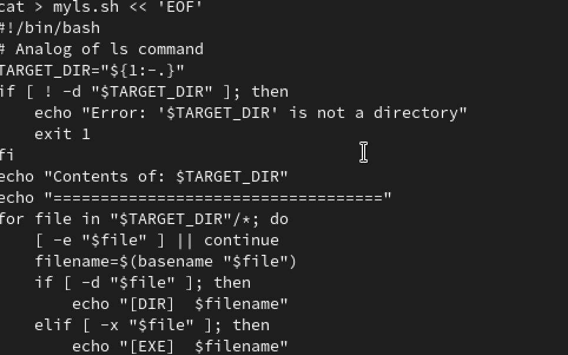

# Настройка рабочей среды

Автор: Матафонова Таисия Антоновнв Преподаватель: Кулябов Дмитрий
Сергеевич профессор \* профессор кафедры теории вероятностей и
кибербезопасности \* Российский университет дружбы народов им. П.
Лумумбы \* [kulyabov-ds\@rudn.ru](mailto:kulyabov-ds@rudn.ru) \*
<https://yamadharma.github.io/ru/>

**Информация о докладчике**

Студентка НБИбд-01-25

------------------------------------------------------------------------

# Цель работы

Изучить основы программирования в оболочке ОС UNIX/Linux. Научиться
писать небольшие командные файлы.

------------------------------------------------------------------------

# Выполнение лабораторной работы

1.Создание директории и скрипта backup_self.sh

{#fig:001}

---

2.Запуск backup_self.sh и проверка результата

{#fig:002}

---

3.Скрипт print_args.sh с 12 аргументами

{#fig:003}

---

4.Создание тестовых файлов и запуск count_by_ext.sh

{#fig:004}

---

5.Работа с myls.sh

{#fig:005}

---

# Список литературы

ТУИС. Архитектура компьютеров и операционные системы. Раздел
"Операционные системы". Лабораторная работа №12.

<https://esystem.rudn.ru/mod/page/view.php?id=1358330>
