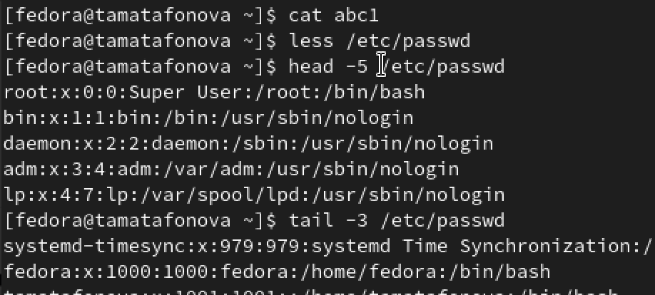
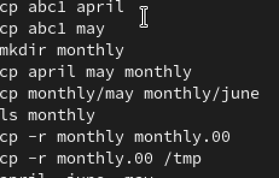
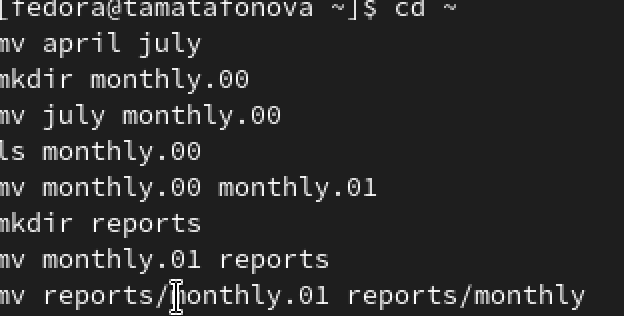
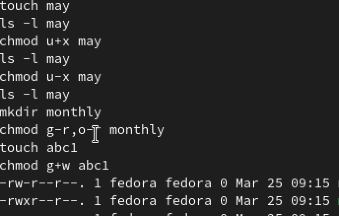
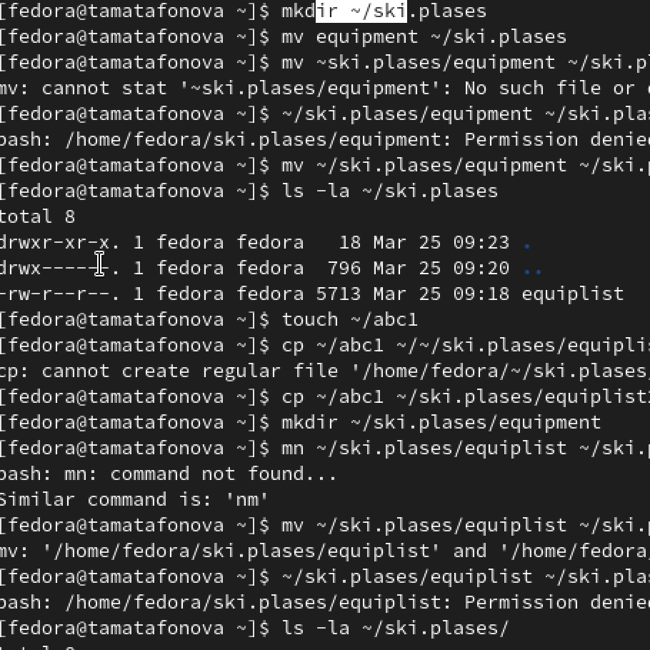
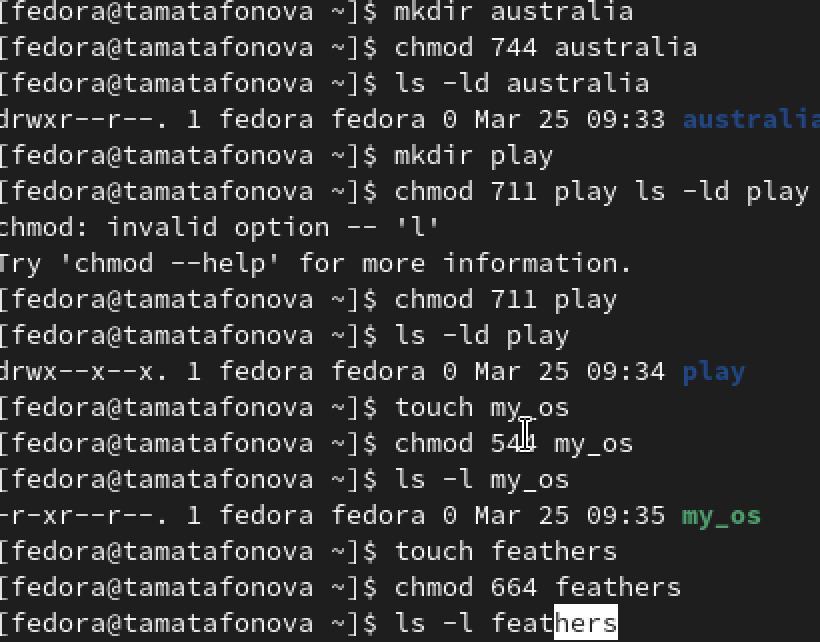
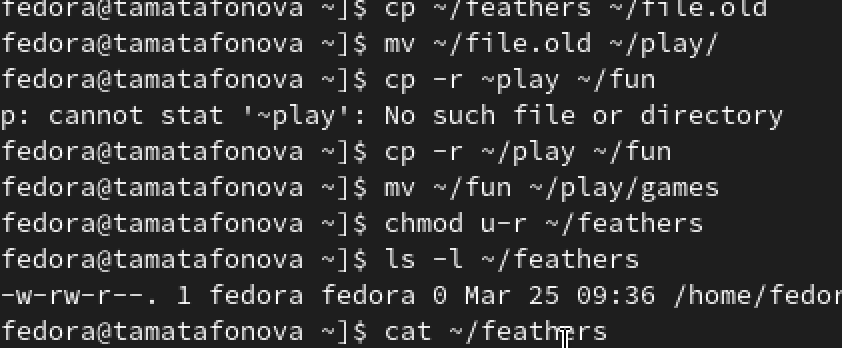
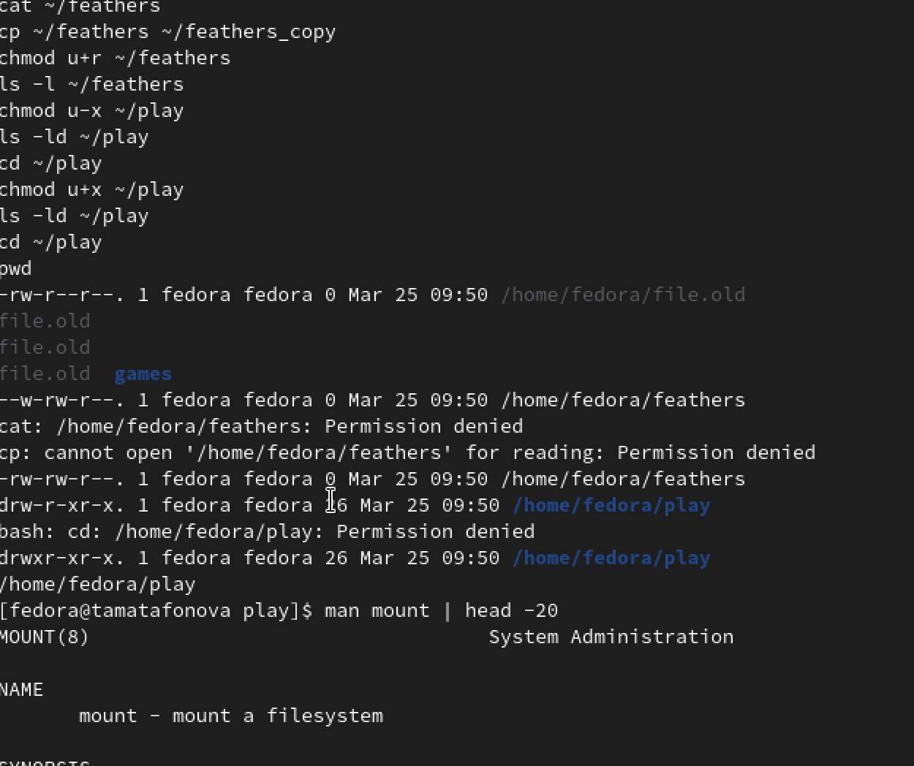

---
author:
  name: Матафонова Таисия Антоновна 
  degrees: DSc
  orcid: 0000-0002-0877-7063
  email: 1032253843@rudn.ru
  affiliation:
    - name: Российский университет дружбы народов
      country: Российская Федерация
      postal-code: 117198
      city: Москва
      address: ул. Миклухо-Маклая, д. 6
title: "Лабораторная работа №7"
subtitle: "Анализ файловой структуры UNIX. Команды для работы с файлами и каталогами"
license: "CC BY"
editor: 
  markdown: 
    wrap: 72
---

# Цель работы

Ознакомление с файловой системой Linux, её структурой, именами и
содержанием каталогов. Приобретение практических навыков по применению
команд для работы с файлами и каталогами, управлению процессами,
проверке использования диска и обслуживанию файловой системы.

# Теоретическое введение

5.2. Указаниякработе 5.2.1. Командыдляработысфайламиикаталогами Для
создания текстового файла можно использовать команду touch. Формат
команды: 1 touch имя-файла Для просмотра файлов небольшого размера можно
использовать команду cat. Формат команды: 1 cat имя-файла Для просмотра
файлов постранично удобнее использовать команду less. Формат команды: 1
less имя-файла Следующие клавиши используются для управления процессом
просмотра: – Space — переход к следующей странице, – ENTER — сдвиг
вперёд на одну строку, – b — возврат на предыдущую страницу, – h —
обращение за подсказкой, – q — выход из режима просмотра файла. Команда
headвыводит по умолчанию первые 10 строк файла. Формат команды: 1 head
\[-n\] имя-файла, где n — количество выводимых строк. Команда
tailвыводит умолчанию 10 последних строк файла. Формат команды: 1 tail
\[-n\] имя-файла, где n — количество выводимых строк. КулябовД.С.идр.
Операционные системы 47 5.2.2. Копированиефайловикаталогов Команда
cpиспользуется для копирования файлов и каталогов. Формат команды: 1 cp
\[-опции\] исходный_файл целевой_файл Примеры: 1. Копирование файла в
текущем каталоге. Скопировать файл \~/abc1 в файл april и в файл may: 1
cd 2 touch abc1 3 cp abc1 april 4 cp abc1 may 2. Копирование нескольких
файлов в каталог. Скопировать файлы aprilи mayв каталог monthly: 1 mkdir
monthly 2 cp april may monthly 3. Копирование файлов в произвольном
каталоге.Скопироватьфайл monthly/mayв файл с именем june: 1 cp
monthly/may monthly/june 2 ls monthly Опция iв команде cpвыведет на
экран запрос подтверждения о перезаписи файла. Для рекурсивного
копирования каталогов, содержащих файлы, используется команда cpс опцией
r. Примеры: 1. Копирование каталогов в текущем каталоге. Скопировать
каталог monthlyв каталог monthly.00: 1 mkdir monthly.00 2 cp -r monthly
monthly.00 2. Копирование каталогов в произвольном каталоге. Скопировать
каталог monthly.00 в каталог /tmp 1 cp -r monthly.00 /tmp 5.2.3.
Перемещениеипереименованиефайловикаталогов Команды mv и mvdir
предназначены для перемещения и переименования файлов и каталогов.
Формат команды mv: 48 Лабораторная работа № 5. Анализ файловой системы
Linux. Команды для работы … 1 mv \[-опции\] старый_файл новый_файл
Примеры: 1. Переименование файлов в текущем каталоге. Изменить название
файла april на julyв домашнем каталоге: 1 cd 2 mv april july 2.
Перемещение файлов в другой каталог. Переместить файл julyв каталог
monthly.00: 1 mv july monthly.00 2 ls monthly.00 Результат: 1 april july
june may 3. Если необходим запрос подтверждения о перезаписи файла, то
нужно использовать опцию i. Переименование каталогов в текущем каталоге.
Переименовать каталог monthly.00 в monthly.01 1 mv monthly.00 monthly.01
4. Перемещение каталога в другой каталог. Переместить каталог
monthly.01в каталог reports: 1 mkdir reports 2 mv monthly.01 reports 5.
Переименование каталога, не являющегося текущим. Переименовать каталог
reports/monthly.01в reports/monthly: 1 mv reports/monthly.01
reports/monthly 5.2.4. Правадоступа Каждый файл или каталог имеет права
доступа (табл. 5.1). В сведениях о файле или каталоге указываются: –
типфайла (символ (-) обозначает файл, а символ (d) — каталог); – права
для владельцафайла (r— разрешено чтение, w— разрешена запись, x— разре-
шено выполнение,-— право доступа отсутствует); – права для
членовгруппы(r— разрешено чтение, w— разрешена запись, x— разрешено
выполнение,-— право доступа отсутствует); – права для всехостальных(r—
разрешено чтение, w— разрешена запись, x— разрешено выполнение,-— право
доступа отсутствует). Примеры: КулябовД.С.идр. Операционные системы 49
Таблица5.1 Правадоступа Право Обозначение Файл Каталог Чтение r
Разрешены просмотр и копирование Разрешён просмотр списка входящих
файлов Разрешены создание и удаление файлов Запись w Разрешены изменение
и пе- реименование Выполнение x Разрешено выполне- ние файла (скриптов
и/или программ) Разрешён доступ в каталог и есть воз- можность сделать
его текущим 1. Для файла (крайнее левое поле имеет значение-) владелец
файла имеет право на чтение и запись (rw-), группа, в которую входит
владелец файла, может читать файл (r--), все остальные могут читать файл
(r--): 1 -rw-r--r-- 2. Только владелец файла имеет право на чтение,
изменение и выполнение файла: 1 -rwx------ 3. Владелец каталога (крайнее
левое поле имеет значение d) имеет право на просмотр, изменение и
доступа в каталог, члены группы могут входить и просматривать его, все
остальные — только входить в каталог: 1 drwxr-x--x 5.2.5.
Изменениеправдоступа Права доступа к файлу или каталогу можно изменить,
воспользовавшись командой chmod. Сделать это может владелец файла (или
каталога) или пользователь с правами администратора. Формат команды: 1
chmod режим имя_файла Режим (в формате команды) имеет следующие
компоненты структуры и способ запи- си: = установить право - лишить
права + дать право r чтение w запись 50 Лабораторная работа № 5. Анализ
файловой системы Linux. Команды для работы … x выполнение u(user)
владелец файла g(group) группа, к которой принадлежит владелец файла
o(others) все остальные В работе с правами доступа можно использовать их
цифровую запись (восьмеричное значение) вместо символьной (табл. 5.2).
Таблица5.2 Формызаписиправдоступа Двоичная Восьмеричная Символьная 111 7
rwx 110 6 rw- 101 5 r-x 100 4 r-- 011 3 -wx 010 2 -w- 001 1 --x 000 0---
Примеры: Требуется создать файл \~/mayс правом выполнения для
владельца: 1. 1 cd 2 touch may 3 ls -l may 4 chmod u+x may 5 ls -l may
2. 1 chmod u-x may 2 ls -l may Требуется лишить владельца файла
\~/mayправа на выполнение: 3. Требуется создать каталог monthlyс
запретом на чтение для членов группы и всех остальных пользователей: 1
cd 2 mkdir monthly 3 chmod g-r, o-r monthly 4. 1 cd 2 touch abc1 3 chmod
g+w abc1 Требуется создать файл \~/abc1с правом записи для членов
группы: КулябовД.С.идр. Операционные системы 51 5.2.6.
Анализфайловойсистемы Файловая система в Linux состоит из фалов и
каталогов. Каждому физическому носи- телю соответствует своя файловая
система. Существует несколько типов файловых систем. Перечислим наиболее
часто встречаю- щиеся типы: – ext2fs (second extended filesystem); –
ext2fs (third extended file system); – ext4 (fourth extended file
system); – ReiserFS; – xfs; – fat (file allocation table); – ntfs (new
technology file system). Для просмотра используемых в операционной
системе файловых систем можно вос- пользоваться командой mount без
параметров. В результате её применения можно получить примерно
следующее: 1 mount 2 10 11 12 13 14 15 3 proc on /proc type proc (rw) 4
sysfs on /sys type sysfs (rw,nosuid,nodev,noexec) 5 udev on /dev type
tmpfs (rw,nosuid) 6 devpts on /dev/pts type devpts (rw,nosuid,noexec) 7
/dev/sda1 on /mnt/a type ext3 (rw,noatime) 8 /dev/sdb2 on /mnt/docs type
reiserfs (rw,noatime) 9 shm on /dev/shm type tmpfs
(rw,noexec,nosuid,nodev) usbfs on /proc/bus/usb type usbfs
(rw,noexec,nosuid,devmode=0664,devgid=85) binfmt_misc on
/proc/sys/fs/binfmt_misc type binfmt_misc (rw,noexec,nosuid,nodev) nfsd
on /proc/fs/nfs type nfsd (rw,noexec,nosuid,nodev) В данном случае
указаны имена устройств, названия соответствующих им точек мон-
тирования (путь), тип файловой системы и параметрами монтирования. В
контексте команды mountустройство— специальный файл устройства, с
помощью которого операционная система получает доступ к аппаратному
устройству. Файлы устройств обычно располагаются в каталоге /dev, имеют
сокращённые имена (например, sdaN, sdbN или hdaN, hdbN, где N —
порядковый номер устройства, sd — устройства SCSI, hd — устройства
MFM/IDE). Точкамонтирования— каталог (путь к каталогу), к которому
присоединяются файлы устройств. Другой способ определения смонтированных
в операционной системе файловых си- стем — просмотр файла/etc/fstab.
Сделать это можно например с помощью команды cat: 1 cat /etc/fstab 2 3
/dev/hda1 / ext2 defaults 1 1 4 /dev/hda5 /home ext2 defaults 1 2 5
/dev/hda6 swap swap defaults 0 0 6 /dev/hdc /mnt/cdrom auto
umask=0,user,noauto,ro,exec,users 0 0 52 Лабораторная работа № 5. Анализ
файловой системы Linux. Команды для работы … 10 7 none /mnt/floppy
supermount dev=/dev/fd0,fs=ext2:vfat,--, 8 sync,umask=0 0 0 9 none /proc
proc defaults 0 0 none /dev/pts devpts mode=0622 0 0 В каждой строке
этого файла указано: – имя устройство; – точка монтирования; – тип
файловой системы; – опции монтирования; – специальные флаги для утилиты
dump; – порядок проверки целостности файловой системы с помощью утилиты
fsck. Для определения объёма свободного пространства на файловой системе
можно вос- пользоваться командой df, которая выведет на экран список
всех файловых систем в соответствии с именами устройств, с указанием
размера и точки монтирования. На- пример: 1 df 2 3 Filesystem
1024-blocks Used Available Capacity Mounted on 4 /dev/hda3 297635 169499
112764 60% / С помощью команды fsckможно проверить (а в ряде случаев
восстановить) целост- ность файловой системы: Формат команды: 1 fsck
имя_устройства Пример: 1 fsck /dev/sda1

# Выполнение лабораторной работы

1.Я создала пустой файл `abc1` с помощью команды `touch abc1`. Затем я
просмотрела его содержимое командой `cat abc1` — файл оказался пустым,
что ожидаемо. После этого я открыла системный файл `/etc/passwd` для
постраничного просмотра с помощью `less /etc/passwd`. Для выхода из
режима просмотра я нажала клавишу `q`. Далее я вывела первые пять строк
этого файла командой `head -5 /etc/passwd` и последние три строки
командой `tail -3 /etc/passwd`. Таким образом я познакомилась с
основными командами для просмотра текстовых файлов.

{#fig:001}

2.Я скопировала файл `abc1` в два новых файла — `april` и `may` — с
помощью команд `cp abc1 april` и `cp abc1 may`. Затем я создала каталог
`monthly` командой `mkdir monthly` и скопировала в него оба файла:
`cp april may monthly`. После этого я скопировала файл `may` внутри
каталога `monthly` в новый файл `june` командой
`cp monthly/may monthly/june`. Для проверки я выполнила `ls monthly` и
увидела файлы `april`, `june`, `may`. Далее я использовала рекурсивное
копирование: `cp -r monthly monthly.00` — это позволило скопировать
каталог вместе со всем содержимым. Затем я скопировала этот каталог в
`/tmp` командой `cp -r monthly.00 /tmp`

{#fig:002}

3.Я переименовала файл `april` в `july` командой `mv april july`. Затем
я создала каталог `monthly.00` и переместила в него файл `july` командой
`mv july monthly.00`. После этого я переименовала каталог `monthly.00` в
`monthly.01` командой `mv monthly.00 monthly.01`. Далее я создала
каталог `reports` командой `mkdir reports` и переместила в него
`monthly.01` командой `mv monthly.01 reports`. Затем я переименовала его
обратно в `monthly` командой `mv reports/monthly.01 reports/monthly`.
Все эти действия показали, что команда `mv` позволяет как
переименовывать, так и перемещать файлы и каталоги.

{#fig:003}

4.Я создала файл `may` командой `touch may` и посмотрела его права через
`ls -l may`. Затем я добавила владельцу право на выполнение командой
`chmod u+x may` и снова проверила права — появилась буква `x`. После
этого я убрала это право командой `chmod u-x may` и убедилась, что права
вернулись к исходным. Далее я создала каталог `monthly` и лишила группу
и остальных пользователей права на чтение командой
`chmod g-r,o-r monthly`. Затем я создала файл `abc1` и добавила группе
право на запись командой `chmod g+w abc1`. Таким образом я научилась
изменять права доступа как в символьном, так и в числовом формате.

{#fig:004}

5.Я скопировала файл `/usr/include/sys/types.h` в домашний каталог под
именем `equipment` командой `cp /usr/include/sys/types.h equipment`.
Затем я создала каталог `~/ski.plases` командой `mkdir ~/ski.plases` и
переместила в него файл `equipment` командой
`mv equipment ~/ski.plases/`. После этого я переименовала его в
`equiplist` командой `mv ~/ski.plases/equipment ~/ski.plases/equiplist`.
Далее я создала файл `abc1` командой `touch ~/abc1` и скопировала его в
каталог `~/ski.plases` под именем `equiplist2` командой
`cp ~/abc1 ~/ski.plases/equiplist2`. Затем я создала внутри
`~/ski.plases` каталог `equipment` командой
`mkdir ~/ski.plases/equipment` и переместила в него оба файла —
`equiplist` и `equiplist2` — одной командой
`mv ~/ski.plases/equiplist ~/ski.plases/equiplist2 ~/ski.plases/equipment/`.
В конце я создала каталог `newdir` и переместила его в `~/ski.plases`,
переименовав в `plans`, командой `mkdir ~/newdir` и
`mv ~/newdir ~/ski.plases/plans`. Проверка через `ls -la ~/ski.plases/`,
`ls -la ~/ski.plases/equipment/` и `ls -la ~/ski.plases/plans/`
подтвердила правильность выполнения.

{#fig:005}

6.Я создала каталог `australia` командой `mkdir australia` и присвоила
ему права `744` (что соответствует `drwxr--r--`) командой
`chmod 744 australia`, после чего проверила результат через
`ls -ld australia`. Затем я создала каталог `play` командой `mkdir play`
и присвоила ему права `711` (что соответствует `drwx--x--x`) командой
`chmod 711 play`, проверила через `ls -ld play`. Далее я создала файл
`my_os` командой `touch my_os` и присвоила ему права `544` (что
соответствует `-r-xr--r--`) командой `chmod 544 my_os`, проверила через
`ls -l my_os`. В конце я создала файл `feathers` командой
`touch feathers` и присвоила ему права `664` (что соответствует
`-rw-rw-r--`) командой `chmod 664 feathers`, проверила через
`ls -l feathers`.

{#fig:006}

7.Я скопировала файл `feathers` в `file.old` командой
`cp ~/feathers ~/file.old`. Затем я переместила `file.old` в каталог
`play` командой `mv ~/file.old ~/play/`. Далее я скопировала каталог
`play` в `fun` рекурсивно командой `cp -r ~/play ~/fun`. После этого я
переместила `fun` внутрь `play` и переименовала в `games` командой
`mv ~/fun ~/play/games`. Затем я лишила владельца файла `feathers` права
на чтение командой `chmod u-r ~/feathers` и проверила права через
`ls -l ~/feathers`. При попытке просмотреть файл командой
`cat ~/feathers` я получила ошибку `Permission denied`. При попытке
скопировать файл командой `cp ~/feathers ~/feathers_copy` также возникла
ошибка. После этого я вернула владельцу право на чтение командой
`chmod u+r ~/feathers` и снова проверила права — они восстановились.

{#fig:007}

8.Я лишила владельца каталога `play` права на выполнение командой
`chmod u-x ~/play` и проверила права через `ls -ld ~/play`. При попытке
перейти в этот каталог командой `cd ~/play` я получила ошибку
`Permission denied`. Затем я вернула владельцу право на выполнение
командой `chmod u+x ~/play` и снова проверила права, после чего успешно
вошла в каталог командой `cd ~/play` и выполнила `pwd` для
подтверждения. После этого я изучила команды `mount`, `fsck`, `mkfs` и
`kill` с помощью команд `man mount | head -20`, `man fsck | head -20`,
`man mkfs | head -20` и `man kill | head -20`. Каждая из этих команд
была кратко охарактеризована.

{#fig:008}

#Контрольные вопросы

1.  На компьютере, на котором выполнялась лабораторная работа,
    используются файловые системы следующих типов: `ext4` для корневого
    раздела, `tmpfs` для временных каталогов `/dev`, `/dev/shm`, `/run`,
    `devpts` для псевдотерминалов, `sysfs` для системной информации,
    `proc` для процессов. `ext4` является основной файловой системой
    Linux, поддерживает журналирование, большие объёмы данных и
    разрешает расширенные права доступа. `tmpfs` хранит данные в
    оперативной памяти, обеспечивая высокую скорость, но не сохраняет
    данные после перезагрузки. `devpts` и `sysfs` являются
    псевдофайловыми системами, предоставляющими интерфейс для управления
    устройствами и ядром. `proc` отображает информацию о процессах и
    параметрах системы.

2.  Общая структура файловой системы Linux имеет иерархический вид,
    начиная с корневого каталога `/`. Директории первого уровня: `/bin`
    — основные утилиты и команды; `/boot` — файлы загрузчика; `/dev` —
    файлы устройств; `/etc` — конфигурационные файлы; `/home` — домашние
    каталоги пользователей; `/lib` — библиотеки; `/media` и `/mnt` —
    точки монтирования сменных и временных устройств; `/opt` —
    дополнительное программное обеспечение; `/proc` — виртуальная
    файловая система процессов; `/root` — домашний каталог
    суперпользователя; `/run` — временные данные системы; `/sbin` —
    утилиты для администрирования; `/srv` — данные сервисов; `/sys` —
    виртуальная файловая система ядра; `/tmp` — временные файлы; `/usr`
    — пользовательские приложения и данные; `/var` — изменяемые данные
    (логи, очереди печати и т.д.).

3.  Чтобы содержимое файловой системы стало доступно операционной
    системе, необходимо выполнить операцию монтирования. Для этого
    используется команда `mount`, которая связывает устройство с
    указанной точкой монтирования — существующим каталогом в файловой
    системе. Например, `mount /dev/sdb1 /mnt/data`. Для автоматического
    монтирования при загрузке используются записи в файле `/etc/fstab`.

4.  Основными причинами нарушения целостности файловой системы являются:
    внезапное отключение питания, аппаратные сбои (повреждение диска),
    ошибки в программном обеспечении, некорректное завершение работы
    системы, вирусные атаки. Для устранения повреждений используется
    команда `fsck` (file system check), которая проверяет и в
    большинстве случаев восстанавливает целостность файловой системы.
    Например, `fsck /dev/sda1`. Перед проверкой рекомендуется
    размонтировать файловую систему, если это возможно.

5.  Файловая система создаётся с помощью команды `mkfs` (make
    filesystem). В общем виде команда выглядит так:
    `mkfs -t тип устройство`, например, `mkfs -t ext4 /dev/sdb1`. Также
    существуют специализированные команды для каждого типа файловой
    системы: `mkfs.ext4`, `mkfs.xfs`, `mkfs.btrfs` и другие. При
    создании файловой системы на устройстве формируется её структура:
    суперблок, таблицы inode, битовые карты свободных блоков и т.д.

6.  Команды для просмотра текстовых файлов: `cat` — выводит всё
    содержимое файла в терминал, удобен для небольших файлов; `less` —
    позволяет постранично просматривать файлы с возможностью прокрутки
    вперёд и назад, поддерживает поиск; `head` — выводит первые 10 строк
    файла (количество можно изменить опцией `-n`); `tail` — выводит
    последние 10 строк файла (также с опцией `-n`). Команда `less`
    является наиболее удобной для больших файлов, так как не загружает
    их целиком в память.

7.  Основные возможности команды `cp`: копирование файла в другой файл
    (`cp source dest`); копирование нескольких файлов в каталог
    (`cp file1 file2 dir/`); копирование с сохранением атрибутов
    (`cp -p`); рекурсивное копирование каталогов (`cp -r` или `cp -R`);
    интерактивный режим с запросом подтверждения перед перезаписью
    (`cp -i`); создание жёстких ссылок (`cp -l`); создание символических
    ссылок (`cp -s`). Команда `cp` не перемещает файлы, а создаёт их
    копии, оставляя исходные нетронутыми.

8.  Команда `mv` используется для перемещения и переименования файлов и
    каталогов. Основные возможности: переименование файла
    (`mv old new`); перемещение файла в другой каталог (`mv file dir/`);
    перемещение нескольких файлов в каталог (`mv file1 file2 dir/`);
    интерактивный режим с запросом подтверждения перед перезаписью
    (`mv -i`); перемещение каталогов без необходимости рекурсивных
    опций. При перемещении в пределах одной файловой системы `mv` просто
    изменяет путь к объекту, не копируя данные, что делает операцию
    быстрой.

9.  Права доступа — это механизм, определяющий, какие действия (чтение,
    запись, выполнение) разрешены для владельца файла, группы и
    остальных пользователей. Права изменяются командой `chmod`.
    Символьный способ: `chmod u+x file` (добавить выполнение владельцу),
    `chmod g-w file` (убрать запись у группы), `chmod o=r file`
    (установить только чтение для остальных). Числовой способ использует
    восьмеричные коды: 4 — чтение, 2 — запись, 1 — выполнение; сумма
    определяет права для владельца, группы и остальных. Например,
    `chmod 755 file` означает `rwxr-xr-x`.

# Выводы

В ходе выполнения лабораторной работы я ознакомилась с файловой системой
Linux и приобрела практические навыки работы с основными командами для
управления файлами и каталогами. Я научилась создавать, копировать,
перемещать и переименовывать файлы и каталоги с помощью команд `touch`,
`cp`, `mv`. Освоила просмотр текстовых файлов различными способами,
используя `cat`, `less`, `head`, `tail`. Изучила механизм прав доступа в
Linux и научилась изменять их с помощью команды `chmod` как в
символьном, так и в числовом формате. Выполнила практические задания по
построению иерархии каталогов, управлению правами доступа, а также
изучила команды `mount`, `fsck`, `mkfs` и `kill` для работы с файловыми
системами и процессами. Все полученные знания закреплены на практике,
структура файловой системы и принципы работы с ней усвоены.

# Список литературы

1.ТУИС РУДН "Лабораторная работа №7"
